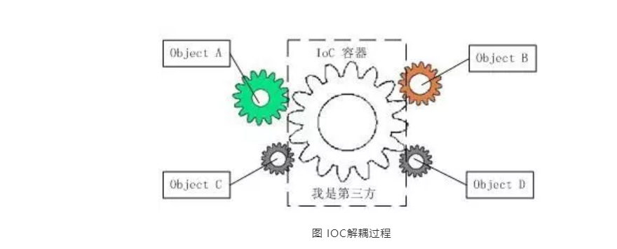
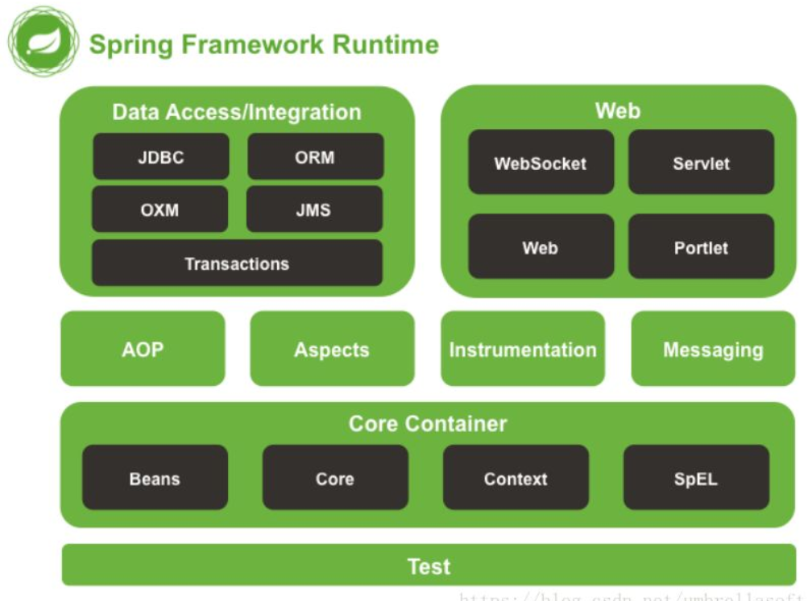

* [90\.为什么要使用spring？](#90%E4%B8%BA%E4%BB%80%E4%B9%88%E8%A6%81%E4%BD%BF%E7%94%A8spring)
  * [1\.简介](#1%E7%AE%80%E4%BB%8B)
  * [2\.轻量](#2%E8%BD%BB%E9%87%8F)
  * [3\.控制反转](#3%E6%8E%A7%E5%88%B6%E5%8F%8D%E8%BD%AC)
  * [4\.面向切面](#4%E9%9D%A2%E5%90%91%E5%88%87%E9%9D%A2)
  * [5\.容器](#5%E5%AE%B9%E5%99%A8)
  * [6\.框架](#6%E6%A1%86%E6%9E%B6)
* [91\.解释一下什么是aop？](#91%E8%A7%A3%E9%87%8A%E4%B8%80%E4%B8%8B%E4%BB%80%E4%B9%88%E6%98%AFaop)
* [92\.解释一下什么是ioc？](#92%E8%A7%A3%E9%87%8A%E4%B8%80%E4%B8%8B%E4%BB%80%E4%B9%88%E6%98%AFioc)
* [93\.Spring有哪些主要模块？](#93spring%E6%9C%89%E5%93%AA%E4%BA%9B%E4%B8%BB%E8%A6%81%E6%A8%A1%E5%9D%97)
* [94\.Spring常用的注入方式有哪些？](#94spring%E5%B8%B8%E7%94%A8%E7%9A%84%E6%B3%A8%E5%85%A5%E6%96%B9%E5%BC%8F%E6%9C%89%E5%93%AA%E4%BA%9B)
* [95\.Spring中的bean是线程安全的吗？](#95spring%E4%B8%AD%E7%9A%84bean%E6%98%AF%E7%BA%BF%E7%A8%8B%E5%AE%89%E5%85%A8%E7%9A%84%E5%90%97)

## 90.为什么要使用spring？

### 1.简介

* **目的：解决企业应用开发的复杂性**
* **功能：使用基本的JavaBean代替EJB，并提供了更多的企业应用功能**
* **范围：任何Java应用**

简单来说，Spring是一个轻量级的控制反转（IOC）和面向切面（AOP）的容器框架。

### 2.轻量

从大小与开销两方面而言Spring都是轻量的。完整的Spring框架可以在一个大小只有1MB多的JAR文件里发布。并且Spring所需的处理开销也是微不足道的。此外，Spring是非侵入式的：典型地，Spring应用中的对象不依赖于Spring的特定类。

### 3.控制反转

Spring通过一种称作控制反转（IoC）的技术促进了松耦合。当应用了IoC，一个对象依赖的其它对象会通过被动的方式传递进来，而不是这个对象自己创建或者查找依赖对象。

你可以认为IoC与JNDI相反——不是对象从容器中查找依赖，而是容器在对象初始化时不等对象请求就主动将依赖传递给它。

### 4.面向切面

Spring提供了面向切面编程的丰富支持，允许通过分离应用的业务逻辑与系统级服务（例如审计（auditing）和事务（transaction）管理）进行内聚性的开发。

应用对象只实现它们应该做的——完成业务逻辑——仅此而已。它们并不负责（甚至是意识）其他的系统级关注点，例如日志或事务支持。

### 5.容器

Spring包含并管理应用对象的配置和生命周期，在这个意义上它是一种容器，你可以配置你的每个bean如何被创建——基于一个可配置原型（prototype），

你的bean可以创建一个单独的实例或者每次需要时都生成一个新的实例——以及它们是如何相互关联的。

### 6.框架

Spring可以将简单的组件配置、组合成为复杂的应用。在Spring中，应用对象被声明式地组合，典型地是在一个XML文件里。Spring也提供了很多基础功能（事务管理、持久化框架集成等等），将应用逻辑的开发留给了你。

所有Spring的这些特征使你能够编写更干净、更可管理、并且更易于测试的代码。它们也为Spring中的各种模块提供了基础支持。

## 91.解释一下什么是aop？

AOP(Aspect-Oriented Programming，面向切面編程)，可以說是OOP(Object-Oriented Programming，面向对象编程)的补充和完善。

OOP引入封装、继承和多态性等概念来建立一种对象层次结构，用以模拟公共行为的一个集合。当我们需要为分散的对象引入公共行为的时候，OOP则显得无能为力。也就是说，OOP允许你定义从上到下的关系，但并不适合定义从左到右的关系。例如日志功能。

日志代码往往水平地散布在所有对象层次中，而与它所散布到的对象的核心功能毫无关系。对于其他类型的代码，如安全性、异常处理和透明的持续性也是如此。

这种散布在各处的无关的代码被称为横切（cross-cutting）代码，在OOP设计中，它导致了大量代码的重复，而不利于各个模块的重用。

而AOP技术则恰恰相反，它利用一种称为"横切"得技术，剖解开封装的对象内部，并将那些影响了多个类的公共行为封装到一个可重用模块，并将其名为"Aspect"，即切面。

所谓"切面"，简单地说，就是讲那些与业务无关，却为业务模块所共同调用的逻辑或责任封装起来，便于减少系统的重复代码，降低模块间的耦合度，并有利于未来的可操作性和可维护性。

使用"横切"技术，AOP把软件系统分为两个部分：核心关注点和横切关注点。业务处理的主要流程是核心关注点，与之关系不大的部分是横切关注点。横切关注点的一个特点是，它们经常发生在核心关注点的多处，而各处都基本相似。比如权限认证、日志、事务处理。AOP的作用在于分离系统中的各个关注点，将核心关注点和横切关注点分离开来。

## 92.解释一下什么是ioc？

IOC是Inversion of Control的缩写，多数书籍翻译成“控制反转”。

IOC理论提出的观点大体是这样的：借助于“第三方”实现具有依赖关系的对象之间的解耦。如下图：

由于引入了中间位置的“第三方”，也就是IOC容器，使得A、B、C、D这4个对象没有了耦合关系，齿轮之间的传动全部依靠“第三方”了，全部对象的控制权全部上缴给“第三方”IOC容器。

所以，IOC容器成了整个系统的关键核心，它起到了一种类似“粘合剂”的作用，把系统中的所有对象粘合在一起发挥作用，

如果没有这个“粘合剂”，对象与对象之间会彼此失去联系，这就是有人把IOC容器比喻成“粘合剂”的由来。

控制反转（IOC）为什么要起这个名字呢？

软件系统在没有引入IOC容器之前，对象A依赖对象B，那么对象A在初始化或者运行到某一点的时候，自己必须主动去创建对象B或者使用已经创建的对象B。无论是创建还是使用对象B，控制权都在自己手上。

软件系统在引入IOC容器之后，这种情形就完全改变了，由于IOC容器的加入，对象A和对象B之间失去了直接联系，所以，当对象A运行到需要对象B的时候，IOC容器会主动创建一个对象B注入到对象A需要的地方。

通过前后的对比，不难看出来：对象A获得依赖对象B的过程，由主动行为变为了被动行为，控制权颠倒过来了，这就是“控制反转”这个名称的由来。

## 93.Spring有哪些主要模块？

Spring框架至今已集成了20多个模块。这些模块主要被分如下图所示的核心容器、数据访问/集成、Web、AOP（面向切面编程）、工具、消息和测试模块。

## 94.Spring常用的注入方式有哪些？

Spring通过DI（依赖注入）实现IOC（控制反转），常用的注入方式主要有三种：

* **a. 构造方法注入**
* **b. setter注入**
* **c. 基于注解的注入**

## 95.Spring中的bean是线程安全的吗？

Spring容器中的Bean是否线程安全，容器本身并没有提供Bean的线程安全策略，因此可以说Spring容器中的Bean本身不具备线程安全的特性，但是具体还是要结合具体scope的Bean去研究。

