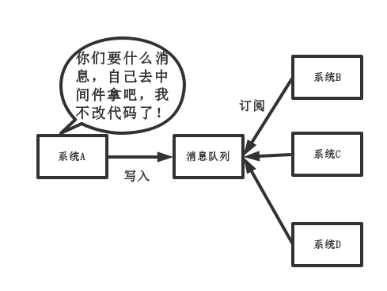
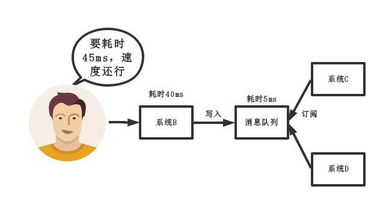

## 1. 为什么要使用消息队列？

这个问题，只答三个最主要的应用场景，解耦，异步，削峰

### 1. 解耦

传统模式：

传统模式的缺点：

* **系统耦合性太强，如上图所示，系统A在代码中直接调用系统B和系统C的代码，如果将来D系统接入，系统A还需要修改代码，过于麻烦！**

中间件模式的优点：

* **将消息写入消息队列，需要消息的系统自己从消息队列中订阅，从而系统A不需要做任何修改**

### 2.异步

传统模式：

传统模式的缺点：

* **一些非必要的业务逻辑以同步的方式运行，太耗费时间**

中间件模式：

中间件模式的优点：

* **将消息写入消息队列，非必要的业务逻辑以异步的方式运行，加快响应速度**

### 3.削峰

传统模式：

传统模式的缺点：

* **并发量大的时候，所有的请求直接怼到数据库，造成数据库连接异常**

中间件模式：

中间件模式的优点：

* **系统A慢慢的按照数据库能处理的并发量，从消息队列中慢慢拉取消息，在生产中，这个短暂的高峰期积压是允许的。**

## 使用了消息队列会有什么缺点?

* **系统可用性降低：本来其他系统只要运行好好的，那你的系统就是正常的，现在非要加个消息队列进去，那消息队列挂了，你的系统不是呵呵了，因此，系统可用性降低**
* **系统复杂性增加：要多考虑很多方面的问题，比如一致性问题，如何保证消息不被重复消费，如何保证消息可靠传输，因此，需要考虑的东西更多，系统复杂度增大**
