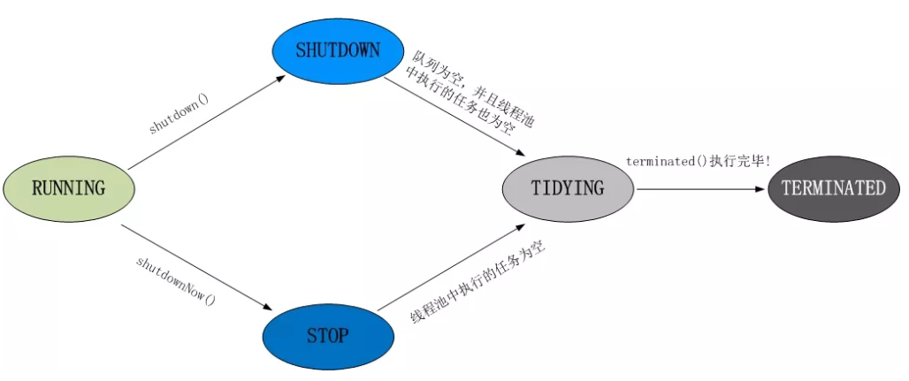
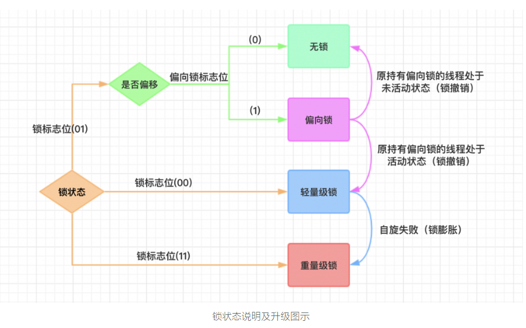

* [35\. 并行和并发有什么区别？](#35-%E5%B9%B6%E8%A1%8C%E5%92%8C%E5%B9%B6%E5%8F%91%E6%9C%89%E4%BB%80%E4%B9%88%E5%8C%BA%E5%88%AB)
* [36\. 线程和进程的区别？](#36-%E7%BA%BF%E7%A8%8B%E5%92%8C%E8%BF%9B%E7%A8%8B%E7%9A%84%E5%8C%BA%E5%88%AB)
* [37\. 守护线程是什么？](#37-%E5%AE%88%E6%8A%A4%E7%BA%BF%E7%A8%8B%E6%98%AF%E4%BB%80%E4%B9%88)
* [38\. 创建线程有哪几种方式？](#38-%E5%88%9B%E5%BB%BA%E7%BA%BF%E7%A8%8B%E6%9C%89%E5%93%AA%E5%87%A0%E7%A7%8D%E6%96%B9%E5%BC%8F)
* [39\. 说一下runnable和callable有什么区别？](#39-%E8%AF%B4%E4%B8%80%E4%B8%8Brunnable%E5%92%8Ccallable%E6%9C%89%E4%BB%80%E4%B9%88%E5%8C%BA%E5%88%AB)
* [40\. 线程有哪些状态？](#40-%E7%BA%BF%E7%A8%8B%E6%9C%89%E5%93%AA%E4%BA%9B%E7%8A%B6%E6%80%81)
* [41\. sleep() 和 wait() 有什么区别？](#41-sleep-%E5%92%8C-wait-%E6%9C%89%E4%BB%80%E4%B9%88%E5%8C%BA%E5%88%AB)
* [42\. notify()和notifyAll()有什么区别？](#42-notify%E5%92%8Cnotifyall%E6%9C%89%E4%BB%80%E4%B9%88%E5%8C%BA%E5%88%AB)
* [43\. 线程的run()和start()有什么区别？](#43-%E7%BA%BF%E7%A8%8B%E7%9A%84run%E5%92%8Cstart%E6%9C%89%E4%BB%80%E4%B9%88%E5%8C%BA%E5%88%AB)
* [44\. 创建线程池有哪几种方式？](#44-%E5%88%9B%E5%BB%BA%E7%BA%BF%E7%A8%8B%E6%B1%A0%E6%9C%89%E5%93%AA%E5%87%A0%E7%A7%8D%E6%96%B9%E5%BC%8F)
* [45\. 线程池都有哪些状态？](#45-%E7%BA%BF%E7%A8%8B%E6%B1%A0%E9%83%BD%E6%9C%89%E5%93%AA%E4%BA%9B%E7%8A%B6%E6%80%81)
* [46\. 线程池中submit()和execute()方法有什么区别？](#46-%E7%BA%BF%E7%A8%8B%E6%B1%A0%E4%B8%ADsubmit%E5%92%8Cexecute%E6%96%B9%E6%B3%95%E6%9C%89%E4%BB%80%E4%B9%88%E5%8C%BA%E5%88%AB)
* [47\. 在java程序中怎么保证多线程的运行安全？](#47-%E5%9C%A8java%E7%A8%8B%E5%BA%8F%E4%B8%AD%E6%80%8E%E4%B9%88%E4%BF%9D%E8%AF%81%E5%A4%9A%E7%BA%BF%E7%A8%8B%E7%9A%84%E8%BF%90%E8%A1%8C%E5%AE%89%E5%85%A8)
* [48\. 多线程锁的升级原理是什么？](#48-%E5%A4%9A%E7%BA%BF%E7%A8%8B%E9%94%81%E7%9A%84%E5%8D%87%E7%BA%A7%E5%8E%9F%E7%90%86%E6%98%AF%E4%BB%80%E4%B9%88)
* [49\. 什么是死锁？](#49-%E4%BB%80%E4%B9%88%E6%98%AF%E6%AD%BB%E9%94%81)
* [50\. 怎么防止死锁？](#50-%E6%80%8E%E4%B9%88%E9%98%B2%E6%AD%A2%E6%AD%BB%E9%94%81)
* [51\. ThreadLocal是什么？有哪些使用场景？](#51-threadlocal%E6%98%AF%E4%BB%80%E4%B9%88%E6%9C%89%E5%93%AA%E4%BA%9B%E4%BD%BF%E7%94%A8%E5%9C%BA%E6%99%AF)
* [52\. 说一下synchronized底层实现原理？](#52-%E8%AF%B4%E4%B8%80%E4%B8%8Bsynchronized%E5%BA%95%E5%B1%82%E5%AE%9E%E7%8E%B0%E5%8E%9F%E7%90%86)
* [53\. synchronized和volatile的区别是什么？](#53-synchronized%E5%92%8Cvolatile%E7%9A%84%E5%8C%BA%E5%88%AB%E6%98%AF%E4%BB%80%E4%B9%88)
* [54\. synchronized和Lock有什么区别？](#54-synchronized%E5%92%8Clock%E6%9C%89%E4%BB%80%E4%B9%88%E5%8C%BA%E5%88%AB)
* [55\. synchronized和ReentrantLock区别是什么？](#55-synchronized%E5%92%8Creentrantlock%E5%8C%BA%E5%88%AB%E6%98%AF%E4%BB%80%E4%B9%88)
* [56\. 说一下atomic的原理？](#56-%E8%AF%B4%E4%B8%80%E4%B8%8Batomic%E7%9A%84%E5%8E%9F%E7%90%86)

## 35. 并行和并发有什么区别？
* **并行是指两个或多个事件在同一时刻发生；而并发是指两个或多个事件在同一时间间隔发生；**
* **并行是在不同实体上的多个事件，并发是在同一实体上的多个事件；**
* **并发是在一台处理器上“同时”处理多个任务，并行是在多台处理器上同时处理多个任务，如hadoop分布式集群；**

所以并发编程的目标是充分地利用处理器的每一个核，以达到最高的处理性能；

## 36. 线程和进程的区别？
* **进程是资源分配最小单位，线程是程序执行的最小单位，一个程序至少有一个进程，一个进程至少有一个线程**
* **进程在执行过程中拥有独立的内存单元，而多个线程共享内存资源，减少切换次数，从而效率更高；**
* **线程是进程的一个实体，是cpu调度和分派的基本单位，是比程序更小的能独立运行的基本单位**
* **线程之间通信更方便，同一个进程下，线程共享全局变量，静态变量等数据，进程之间的通信需要以通信的方式（IPC）进行；**
* **同一进程中的多个线程之间可以并发执行**

## 37. 守护线程是什么？
* **守护线程（即daemon thread），是个服务线程，准确来说就是服务其他的线程，最典型的就是垃圾回收**

## 38. 创建线程有哪几种方式？
* **1. 继承Thread类创建线程类**

  * **定义Thread类的子类，并重写该类的run方法，该run方法的方法体就代表了线程要完成的任务。因此把run()
      方法称为执行体。**
  * **创建Thread子类的实例，即创建了线程对象。**
  * **调用线程对象的start()方法来启动该线程。**
* **2. 通过Runnable接口创建线程类**
  * **定义runnable接口的实现类，并重写该接口的run方法，该run方法的方法体同样是该线程的线程执行体。**
  * **创建Runnable实现类的实例，并依此实例作为Thread的target来创建Thread对象，该Thread对象才是真正的线程对象。**
  * **调用线程对象的start()方法来启动该线程。**
* **3. 通过Callable和Future创建线程**
  * **创建Callable接口的实现类，并实现call()方法，该call()方法将作为线程执行体，并且有返回值。**
  * **创建Callable实现类的实例，使用FutureTask类来包装Callable对象，该FutureTask对象封装了该Callable对象的call()方法的返回值。**
  * **使用FutureTask对象作为Thread对象的target创建并启动新线程。**
  * **调用FutureTask对象的get()方法来获得子线程执行结束后的返回值。**

## 39. 说一下runnable和callable有什么区别？
  * **Runnable接口中的run()方法的返回值是void，它做的事情只是纯粹地去执行run()方法中的代码而已；**
  * **Callable()接口中的call()方法是有返回值的，是一个泛型，和Future、FutureTask配合可以用来获取异步执行的结果。**

## 40. 线程有哪些状态？
  线程通常都有五种状态，创建、就绪、运行、阻塞和死亡。
  * **创建状态。在生成线程对象，并没有调用该对象的start方法，这是线程处于创建状态。**
  * **就绪状态。当调用了线程对象的start方法之后，该线程就进入了就绪状态，但是此时线程调度程序还没有把该线程设置为当前线程，此时处于就绪状态。在线程运行之后，从等待或者睡眠中回来之后，也会处于就绪状态。**
  * **运行状态。线程调度程序将处于就绪状态的线程设置为当前线程，此时线程就进入了运行状态，开始运行run函数当中的代码。**
  * **阻塞状态。线程正在运行的时候，被暂停，通常是为了等待某个时间的发生（比如说某项资源就绪）之后再继续运行。sleep、suspend、wait等方法都可以导致线程阻塞。**
  * **死亡状态。如果一个线程的run方法执行结束或者调用stop方法后，该线程就会死亡。对于已经死亡的线程，无法再使用start方法令其进入就绪。**
  
## 41. sleep() 和 wait() 有什么区别？
sleep()：方法是线程类（Thread）的静态方法，让调用线程进入睡眠状态，让出执行机会给其他线程，等到休眠时间结束后，线程进入就绪状态和其他线程一起竞争cpu的执行时间。

因为sleep()是static静态的方法，它不能改变对象的机锁，当一个synchronized块中调用了sleep()方法，线程虽然进入休眠，但是对象的机锁没有被释放，其他线程依然无法访问这个对象。

wait()：wait()是Object类的方法，当一个线程执行到wait方法时，它就进入到一个和该对象相关的等待池，同时释放对象的机锁，使得其他线程能够访问，可以通过notify，notifyAll方法来唤醒等待的线程。

## 42. notify()和notifyAll()有什么区别？
* **如果线程调用了对象的wait()方法，那么线程便会处于该对象的等待池中，等待池中的线程不会去竞争该对象的锁。**
* **notifyAll()方法唤醒所有wait线程，notify()方法只随机唤醒一个wait线程；被唤醒的线程便会进入该对象的锁池中，锁池中的线程会去竞争该对象锁。也就是说，调用了notify后只有一个线程会由等待池进入锁池，而notifyAll()会将该对象等待池内所有线程移动到锁池中，等待锁竞争。**
* **优先级高的线程竞争到对象锁的概率大，假若某线程没有竞争到该对象锁，它还会留在锁池中，唯有该线程再次调用wait()方法，它才会重新回到等待池中。而竞争到对象锁的线程则继续往下执行，直到执行完了synchronized代码块，它会释放掉该对象锁，这时锁池中的线程会继续竞争该对象锁。**

## 43. 线程的run()和start()有什么区别？
每个线程都是通过某个特定Thread对象所对应的方法run()来完成其操作的，方法run()称为线程体。通过调用Thread类的start()方法来启动一个线程。
* **run()方法是在本线程里的，只是线程里的一个函数，而不是多线程的。如果直接调用run()，其实就相当于是调用了一个普通函数而已，必须等待run()方法执行完毕才能执行下面的代码，所以执行路径还是只有一条，根本就没有多程的特征**
* **start()方法来启动一个线程，真正实现了多线程运行。这时无需等待run方法体代码执行完毕，可以直接继续执行下面的代码；这时此线程是处于就绪状态，并没有运行。然后通过此Thread类调用方法run()来完成其运行状态，这里方法run()称为线程体，run()方法运行结束，此线程终止。然后cpu再调度其他线程。**

## 44. 创建线程池有哪几种方式？
* **1. newFixedThreadPool(int nThreads)**

  创建一个固定长度的线程池，每当提交一个任务就创建一个线程，直到达到线程池的最大数量，这时线程规模将不再变化；
  
* **2. newSingleThreadExecutor()**
  
    工作线程数目被限制为1，操作一个无界的工作队列，所以保证了所有任务都是被顺序执行，

* **3. newCachedThreadPool()**

  创建缓存线程池，该线程池中的线程会随着任务的提交不断被创建，但是先前创建的可用的线程仍然可以被复用。当线程空闲时间超过60秒后会被终止和从缓存中移除，这种线程池适合那些有大量短执行时间的异步任务。

* **4. newScheduledThreadPool(int corePoolSize)**

  创建一个固定长度的线程池，而且以延迟或者定时的方式来执行任务，类似于Timer

## 45. 线程池都有哪些状态？

线程池有5种状态：Running、shutdown、stop、tidying、terminated。
* **1. running**

  1.1 状态说明：线程池处在running状态时，能够接收新任务，以及对已添加的任务进行处理。
  
  1.2 状态切换：线程池的初始化状态就是running。换句话说，线程池一旦被创建，就处于running状态，并且线程池中的任务数为0！

* **2. shutdown**
  
  2.1 状态说明：线程池处在shutdown状态时，不接收新任务，但能处理已添加的任务。
  
  2.2 状态切换：调用线程池的shutdown()接口是，线程池由running->shutdown。

* **3. stop**
  
  3.1 状态说明：线程池处在stop状态时，不接收新任务，不处理已添加的任务，并且会中断正在处理的任务。
  
  3.2 状态切换：调用线程池的shutdownNow()接口时，线程池由（Running or shutdown）-> stop。

* **4. tidying**
  
  4.1 状态说明：当所有任务已终止，ctl记录的任务数量为0，线程池会变为tidying状态。
  
  当线程池变为tidying状态时，会执行钩子函数terminated()。
  
  terminated()在ThreadPoolExecutor类中是空的，若用户想在线程池变为tidying时，进行相应的处理，可以通过重载terminated()函数来实现。
  
  4.2 状态切换：当线程池在shutdown状态下，阻塞队列为空并且线程池中执行的任务也为空时，就会由shutdown->tidying。
  
  当线程池在stop状态下，线程池中执行的任务为空时，就会由stop->tidying。
  
* **5. terminated**

  5.1 状态说明：线程池彻底终止，就变成terminated状态。
  5.2 状态切换：线程池处在tidying状态时，执行完terminated()之后，就会由tidying->terminated。

  线程池各个状态切换框架图：

## 46. 线程池中submit()和execute()方法有什么区别？

* **1. 接收的参数不一样**

  execute()参数Runnable；submit()参数（Runnable）或（Runnable和结果T）或（Callable）

* **2. execute()没有返回值，而submit()有返回值**
* **3. submit()的返回值Future调用get()方法时，可以捕获并处理异常**

## 47. 在java程序中怎么保证多线程的运行安全？

线程安全在三个方面体现：
* **原子性：提供互斥访问，同一时刻只能有一个线程对数据进行操作，（atomic，synchronized）；**
* **可见性：一个线程对主内存的修改可以及时地被其他线程看到，（synchronized，volatile）**
* **有序性：一个线程观察其他线程中的指令执行顺序，由于指令重排序，该观察结果一般杂乱无序，（happens-before原则）**

## 48. 多线程锁的升级原理是什么？

在java中，锁共有四种状态，级别从低到高依次为：无状态锁，偏向锁，轻量级锁和重量级锁状态，这几个锁会随着竞争情况逐渐升级，锁可以升级但不能降级。

在所有锁都启动的情况下线程进入临界区时会先去获取偏向锁，

如果已经存在偏向锁了，则会尝试获取轻量级锁，启用自旋锁，如果自旋也没获取到锁，则使用重量级锁，

没有获取到锁的线程阻塞挂起，直到持有锁的线程执行完同步块；

锁升级的图示过程：

| | 偏向锁 | 轻量级锁 | 重量级锁
| :------: | :------: | :------: | :------: | 
适用场景 | 只有一个线程进入同步块 | 虽然很多线程，但是没有冲突：多条线程进入同步块，但是线程进入时间错开因而并未争抢锁 | 发生了锁争抢的情况：多条线程进入同步块并争用锁
本质 | 取消同步操作 | CAS操作代替互斥同步 | 互斥同步
优点 | 不阻塞，执行效率高（只有第一次获取偏向锁时需要CAS操作，后面只是比对ThreadId） | 不会阻塞 | 不会空耗CPU
缺点 | 适用场景太局限。若竞争产生，会有额外的偏向锁撤销的消耗 | 长时间获取不到锁空耗CPU | 阻塞，上下文切换，重量级操作，消耗操作系统资源

## 49. 什么是死锁？

死锁是指两个或两个以上的进程在执行过程中，由于竞争资源或者由于彼此通信而造成的一种阻塞的现象，若无外力作用，它们都将无法推进下去。此时称系统为死锁状态或系统产生了死锁，这些永远在互相等待的进程称为死锁进程。

## 50. 怎么防止死锁？

死锁的四个必要条件：
* **互斥条件：进程对所分配到的资源不允许其他进程进行访问，若其他进程访问该资源，只能等待，直至占有该资源的进程进程使用完成后释放该资源**
* **请求和保持条件：进程获得一定的资源之后，又对其他资源发出请求，但是该资源可能被其他进程占有，此事请求阻塞，但又对自己获得的资源保持不放。**
* **不可剥夺条件：是指进程已获得的资源，在未完成使用之前，不可被剥夺，只能在使用完后自己释放**
* **环路等待条件：是指进程发生死锁后，若干进程之间形成一种头尾相接的循环等待资源关系**

这四个条件是死锁的必要条件，只要系统发生死锁，这些条件必然成立，而只要上述条件之一不满足，就不会发生死锁。

## 51. ThreadLocal是什么？有哪些使用场景？

线程局部变量是局限于线程内部的变量，属于线程自身所有，不在多个线程间共享。Java提供ThreadLocal类来支持线程局部变量，是一种实现线程安全的方式。

但是在管理环境下（如web服务器），使用线程局部变量的时候要特别小心，在这种情况下，工作线程的生命周期比任何应用变量的生命周期都要长。任何线程局部变量一旦在工作完成后没有释放，Java应用就存在内存泄漏的风险。

## 52. 说一下synchronized底层实现原理？

synchronized可以保证方法或代码块在运行时，同一时刻只有一个方法可以进入到临界区，同时它还可以保证共享变量的内存可见性。

Java中每一个对象都可以作为锁，这是synchronized实现同步的基础：
* **普通同步方法：锁是当前实例对象**
* **静态同步方法：锁是当前类的class对象**
* **同步方法块，锁是括号里面的对象**

JVM通过进入和退出Monitor对象来实现代码块同步和方法同步，两者实现细节不同。

* **代码块同步：在编译后通过将monitorenter指令插入到同步代码块的开始处，将monitorexit指令插入到方法结束处和异常处，通过反编译字节码可以观察到。任何一个对象都有一个monitor与之关联，线程执行monitorenter指令时，会尝试获取对象对应的monitor的所有权，即尝试获得对象的锁。**
* **方法同步：synchronized方法在method_info结构有ACC_synchronized标记，线程执行时会识别该标记，获取对应的锁，实现方法同步。**

两者虽然实现细节不同，但本质上都是对一个对象的监视器（monitor）的获取。任意一个对象都拥有自己的监视器，当同步代码块或同步方法时，执行方法的线程必须先获得该对象的监视器才能进入同步块或同步方法，没有获取到监视器的线程将会被阻塞，并进入同步队列，状态变为BLOCKED。当成功获取监视器的线程释放了锁后，会唤醒阻塞在同步队列的线程，使其重新尝试对监视器的获取。

## 53. synchronized和volatile的区别是什么？

* **volatile本质是在告诉jvm当前变量在寄存器（工作内存）中的值是不确定的，需要从主存中读取；**
  * **synchronized则是锁定当前变量，只有当前线程可以访问该变量，其他线程被阻塞住。**
* **volatile仅能使用在变量级别；synchronized则可以使用在变量、方法和类级别。**
* **volatile仅能实现变量的修改可见性，不能保证原子性；而synchronized则可以保证变量的修改可见性和原子性。**
* **volatile不会造成线程的阻塞；synchronized可能会造成线程的阻塞。**
* **volatile标记的变量不会被编译器优化；synchronized标记的变量可以被编译器优化。**

## 54. synchronized和Lock有什么区别？

* **Lock是个接口，synchronized是java内置关键字；**
* **通过Lock可以知道有没有成功获取锁，而synchronized却无法办到；**
* **synchronized会自动释放锁（a线程执行完同步代码会释放锁；b线程执行过程中发生异常会释放锁），Lock需要在finally中手工释放锁（unlock()方法释放锁），否则容易造成线程死锁；**
* **Lock可以让等待锁的线程响应中断，而synchronized却不行，使用synchronized时，等待的线程会一直等待下去，不能够响应中断；**
* **Lock可以提高多个线程进行读操作的效率；**
* **synchronized的锁可重入、不可中断、非公平，而Lock锁可重入、可判断、可公平（两者皆可）**
* **Lock锁适合大量同步的代码的同步问题，synchronized锁适合代码少量的同步问题。**

## 55. synchronized和ReentrantLock区别是什么？

synchronized是和if、else、for、while一样的关键字，ReentrantLock是类，这是二者的本质区别。

既然ReentrantLock是类，那么它就提供了比synchronized更多更灵活的特性，可以被继承、可以有方法、可以有各种各样的类变量，ReentrantLock比synchronized的扩展性体现在几点上：

* **1. 等待可中断；持有锁的线程长期不释放的时候，正在等待的线程可以选择放弃等待，这相对于Synchronized来说可以避免出现死锁的情况，通过lock.lockInterruptibly()来实现这个机制。**
* **2. 公平锁；多个线程等待同一个锁时，必须按照申请锁的时间顺序获得锁，synchronized锁非公平锁，ReentrantLook默认的构造函数是创建的非公平锁，可以通过参数true设为公平锁，但公平锁表现的性能不是很好。**
* **3. 锁绑定多个条件；一个ReentrantLock对象可以同时绑定对个对象。ReenTrantLock提供了一个Condition（条件）类，用来实现分组唤醒需要唤醒的线程们，而不是像synchronized要么随机唤醒一个线程要么唤醒全部线程**

## 56. 说一下atomic的原理？

Atomic包中的类基本的特性就是在多线程环境下，当有多个线程同时对单个（包括基本类型及引用类型）变量进行操作时，具有排他性，即当多个线程同时对该变量的值进行更新时，仅有一个线程能成功，而未成功的线程可以像自旋锁一样，继续尝试，一直等到执行成功。

Atomic系列的类中的核心方法都会调用unsafe类中的几个本地方法。

unsafe类全名为：sun.misc.Unsafe，这个类包含了大量对C代码的操作，包括很多直接内存分配以及原子操作的调用，而它之所以标记为非安全的，是告诉你这个里面大量的方法调用都会存在安全隐患，需要小心使用，否则会导致严重的后果。

例如在通过unsafe分配内存的时候，如果自己指定某些区域可能会导致一些类似C++一样的指针越界到其他进程的问题。

