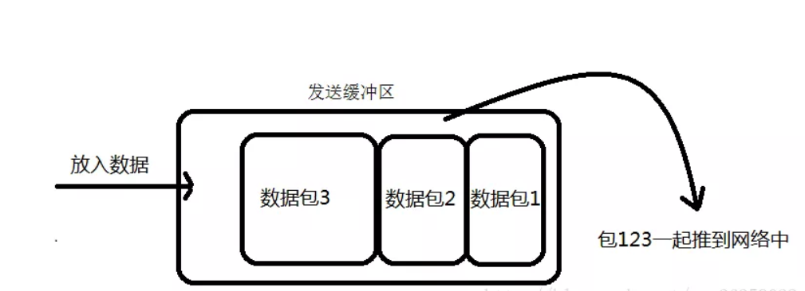
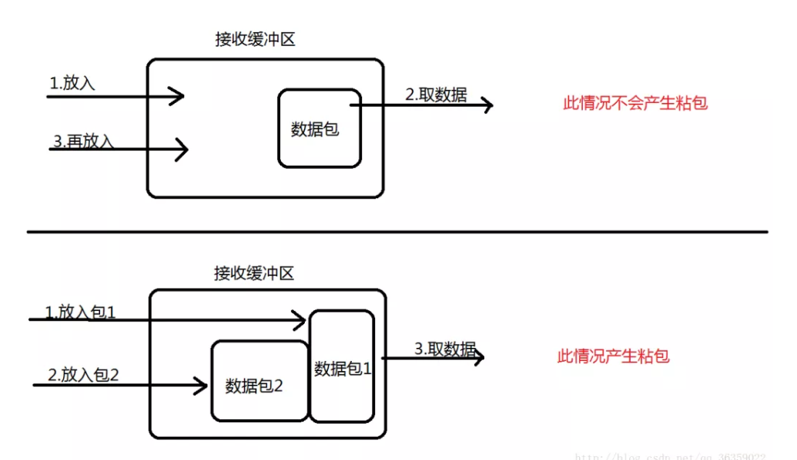

* [79\. http 响应码 301 和 302 代表的是什么？有什么区别？](#79-http-%E5%93%8D%E5%BA%94%E7%A0%81-301-%E5%92%8C-302-%E4%BB%A3%E8%A1%A8%E7%9A%84%E6%98%AF%E4%BB%80%E4%B9%88%E6%9C%89%E4%BB%80%E4%B9%88%E5%8C%BA%E5%88%AB)
* [80\. forward 和 redirect 的区别？](#80-forward-%E5%92%8C-redirect-%E7%9A%84%E5%8C%BA%E5%88%AB)
* [81\. 简述 tcp 和 udp的区别？](#81-%E7%AE%80%E8%BF%B0-tcp-%E5%92%8C-udp%E7%9A%84%E5%8C%BA%E5%88%AB)
* [82\. tcp 为什么要三次握手，两次不行吗？为什么？](#82-tcp-%E4%B8%BA%E4%BB%80%E4%B9%88%E8%A6%81%E4%B8%89%E6%AC%A1%E6%8F%A1%E6%89%8B%E4%B8%A4%E6%AC%A1%E4%B8%8D%E8%A1%8C%E5%90%97%E4%B8%BA%E4%BB%80%E4%B9%88)
* [83\. 说一下 tcp 粘包是怎么产生的？](#83-%E8%AF%B4%E4%B8%80%E4%B8%8B-tcp-%E7%B2%98%E5%8C%85%E6%98%AF%E6%80%8E%E4%B9%88%E4%BA%A7%E7%94%9F%E7%9A%84)
* [84\. OSI 的七层模型都有哪些？](#84-osi-%E7%9A%84%E4%B8%83%E5%B1%82%E6%A8%A1%E5%9E%8B%E9%83%BD%E6%9C%89%E5%93%AA%E4%BA%9B)
* [85\. get 和 post 请求有哪些区别？](#85-get-%E5%92%8C-post-%E8%AF%B7%E6%B1%82%E6%9C%89%E5%93%AA%E4%BA%9B%E5%8C%BA%E5%88%AB)

## 79. http 响应码 301 和 302 代表的是什么？有什么区别？

答：301，302 都是HTTP状态的编码，都代表着某个URL发生了转移。

区别： 

* **301 redirect: 301 代表永久性转移(Permanently Moved)。**

* **302 redirect: 302 代表暂时性转移(Temporarily Moved )。**

当一个网站或者网页24—48小时内临时移动到一个新的位置，这时候就要进行302跳转，

打个比方说，我有一套房子，但是最近走亲戚去亲戚家住了，过两天我还回来的。

而使用301跳转的场景就是之前的网站因为某种原因需要移除掉，然后要到新的地址访问，是永久性的，

就比如你换房子了，之前租的房子不住了。

## 80. forward 和 redirect 的区别？

Forward和Redirect代表了两种请求转发方式：直接转发和间接转发。

直接转发方式（Forward），客户端和浏览器只发出一次请求，Servlet、HTML、JSP或其它信息资源，由第二个信息资源响应该请求，在请求对象request中，保存的对象对于每个信息资源是共享的。

间接转发方式（Redirect）实际是两次HTTP请求，服务器端在响应第一次请求的时候，让浏览器再向另外一个URL发出请求，从而达到转发的目的。

举个通俗的例子：

直接转发就相当于：“A找B借钱，B说没有，B去找C借，借到借不到都会把消息传递给A”；

间接转发就相当于："A找B借钱，B说没有，让A去找C借"。

## 81. 简述 tcp 和 udp的区别？

* **TCP面向连接（如打电话要先拨号建立连接）;UDP是无连接的，即发送数据之前不需要建立连接。**

* **TCP提供可靠的服务。也就是说，通过TCP连接传送的数据，无差错，不丢失，不重复，且按序到达;UDP尽最大努力交付，即不保证可靠交付。**

* **Tcp通过校验和，重传控制，序号标识，滑动窗口、确认应答实现可靠传输。如丢包时的重发控制，还可以对次序乱掉的分包进行顺序控制。**

* **UDP具有较好的实时性，工作效率比TCP高，适用于对高速传输和实时性有较高的通信或广播通信。**

* **每一条TCP连接只能是点到点的;UDP支持一对一，一对多，多对一和多对多的交互通信。**

* **TCP对系统资源要求较多，UDP对系统资源要求较少。**

## 82. tcp 为什么要三次握手，两次不行吗？为什么？

为了实现可靠数据传输， TCP 协议的通信双方， 都必须维护一个序列号， 以标识发送出去的数据包中， 哪些是已经被对方收到的。 三次握手的过程即是通信双方相互告知序列号起始值， 并确认对方已经收到了序列号起始值的必经步骤。

如果只是两次握手， 至多只有连接发起方的起始序列号能被确认， 另一方选择的序列号则得不到确认。

## 83. 说一下 tcp 粘包是怎么产生的？

①. 发送方产生粘包

采用TCP协议传输数据的客户端与服务器经常是保持一个长连接的状态（一次连接发一次数据不存在粘包），双方在连接不断开的情况下，可以一直传输数据；但当发送的数据包过于的小时，那么TCP协议默认的会启用Nagle算法，将这些较小的数据包进行合并发送（缓冲区数据发送是一个堆压的过程）；这个合并过程就是在发送缓冲区中进行的，也就是说数据发送出来它已经是粘包的状态了。

②. 接收方产生粘包

接收方采用TCP协议接收数据时的过程是这样的：数据到底接收方，从网络模型的下方传递至传输层，传输层的TCP协议处理是将其放置接收缓冲区，然后由应用层来主动获取（C语言用recv、read等函数）；这时会出现一个问题，就是我们在程序中调用的读取数据函数不能及时的把缓冲区中的数据拿出来，而下一个数据又到来并有一部分放入的缓冲区末尾，等我们读取数据时就是一个粘包。（放数据的速度 > 应用层拿数据速度） 

## 84. OSI 的七层模型都有哪些？

* **1. 应用层：网络服务与最终用户的一个接口。**
* **2. 表示层：数据的表示、安全、压缩。**
* **3. 会话层：建立、管理、终止会话。**
* **4. 传输层：定义传输数据的协议端口号，以及流控和差错效验。**
* **5. 网络层：进行逻辑地址寻址，实现不同网络之间的路径选择。**
* **6. 数据链路层：建立逻辑连接、进行硬件地址寻址、差错校验等功能。**
* **7. 物理层：建立、维护、断开物理连接。** 

## 85. get 和 post 请求有哪些区别？

* **GET在浏览器回退时是无害的，而POST会再次提交请求。**
* **GET产生的URL地址可以被Bookmark（书签），而POST不可以。**
* **GET请求会被浏览器主动cache，而POST不会，除非手动设置。**
* **GET请求只能进行url编码，而POST支持多种编码方式。**
* **GET请求参数会被完整保留在浏览器历史记录里，而POST中的参数不会被保留。**
* **GET请求在URL中传送的参数是有长度限制的，而POST没有。**
* **对参数的数据类型，GET只接受ASCII字符，而POST没有限制。**
* **GET比POST更不安全，因为参数直接暴露在URL上，所以不能用来传递敏感信息。**
* **GET参数通过URL传递，POST放在Request body中。**

