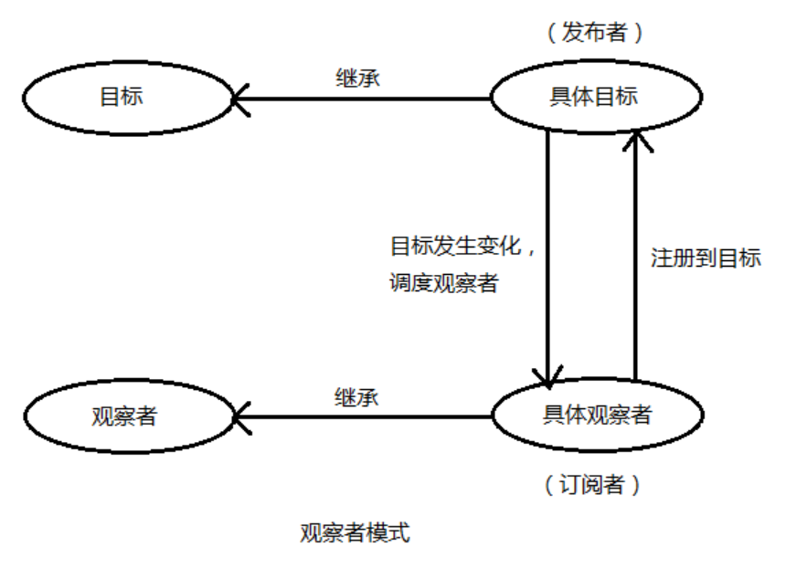
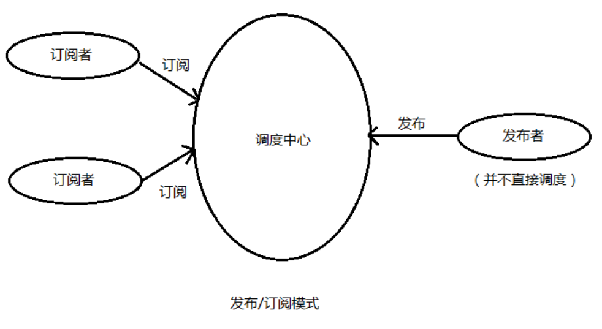
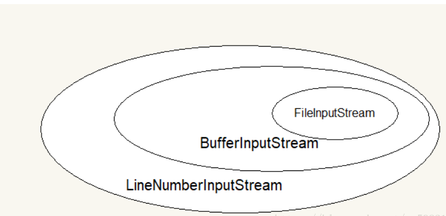
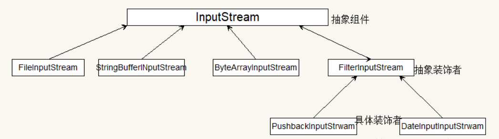
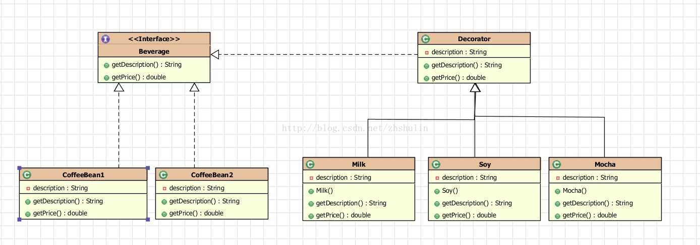

* [88\. 说一下你熟悉的设计模式？](#88-%E8%AF%B4%E4%B8%80%E4%B8%8B%E4%BD%A0%E7%86%9F%E6%82%89%E7%9A%84%E8%AE%BE%E8%AE%A1%E6%A8%A1%E5%BC%8F)
  * [单例模式](#%E5%8D%95%E4%BE%8B%E6%A8%A1%E5%BC%8F)
  * [观察者模式](#%E8%A7%82%E5%AF%9F%E8%80%85%E6%A8%A1%E5%BC%8F)
  * [发布/订阅模式](#%E5%8F%91%E5%B8%83%E8%AE%A2%E9%98%85%E6%A8%A1%E5%BC%8F)
    * [观察者模式和发布\-订阅者模式之间的区别](#%E8%A7%82%E5%AF%9F%E8%80%85%E6%A8%A1%E5%BC%8F%E5%92%8C%E5%8F%91%E5%B8%83-%E8%AE%A2%E9%98%85%E8%80%85%E6%A8%A1%E5%BC%8F%E4%B9%8B%E9%97%B4%E7%9A%84%E5%8C%BA%E5%88%AB)
  * [装饰者模式](#%E8%A3%85%E9%A5%B0%E8%80%85%E6%A8%A1%E5%BC%8F)

## 88. 说一下你熟悉的设计模式？

### 单例模式

简单点说，就是一个应用程序中，某个类的实例对象只有一个，你没有办法去new，因为构造器是被private修饰的，一般通过getInstance()的方法来获取它们的实例。

getInstance()的返回值是一个对象的引用，并不是一个新的实例，所以不要错误的理解成多个对象。

一般来说，单例模式有五种写法：饿汉、懒汉、懒汉双重检验锁、静态内部类、枚举。

### 观察者模式

对象间一对多的依赖关系，当一个对象的状态发生改变时，所有依赖于它的对象都得到通知并被自动更新。

比较概念的解释是，目标和观察者是基类，目标提供维护观察者的一系列方法，观察者提供更新接口。具体观察者和具体目标继承各自的基类，然后具体观察者把自己注册到具体目标里，在具体目标发生变化时候，调度观察者的更新方法。

比如有个“天气中心”的具体目标A，专门监听天气变化，而有个显示天气的界面的观察者B，B就把自己注册到A里，当A触发天气变化，就调度B的更新方法，并带上自己的上下文。

### 发布/订阅模式

比较概念的解释是，订阅者把自己想订阅的事件注册到调度中心，当该事件触发时候，发布者发布该事件到调度中心（顺带上下文），由调度中心统一调度订阅者注册到调度中心的处理代码。

比如有个界面是实时显示天气，它就订阅天气事件（注册到调度中心，包括处理程序），当天气变化时（定时获取数据），就作为发布者发布天气信息到调度中心，调度中心就调度订阅者的天气处理程序。

#### 观察者模式和发布-订阅者模式之间的区别
* **1.Observer模式，观察者是知道Subject主题的，目标主题一直保持对观察者的记录，而publish-subscribe模式中，订阅者和发布者互相不知道对方，通过消息代理进行通信。**
* **2.Observer模式中，观察者和主题之间存在以来耦合关系，而发布订阅者模式则完全松耦合。**
* **3.多数情况下，Observer模式是同步，例如事件触发，而发布-订阅者使用的消息队列模式，大多数处理异步事件。**

### 装饰者模式

对已有的业务逻辑进一步的封装，使其增加额外的功能，如Java中的IO流就使用了装饰者模式，用户在使用的时候，可以任意组装，达到自己想要的效果。

BufferInputStream，LineNumberInputStream都是扩展自抽象的装饰类FileInputStream。

举例说明，咖啡是一种饮料，咖啡的本质是咖啡豆+水磨出来的。咖啡店现在要卖各种口味的咖啡，如果不使用装饰模式，那么在销售系统中，各种不一样的咖啡都要产生一个类，如果有4中咖啡豆，5种口味，那么将要产生至少20个类（不包括混合口味），非常麻烦。使用了装饰模式，只需要11个类即可生产任意口味咖啡（包括混合口味）。

参考designpattern.decorator包下的demo

