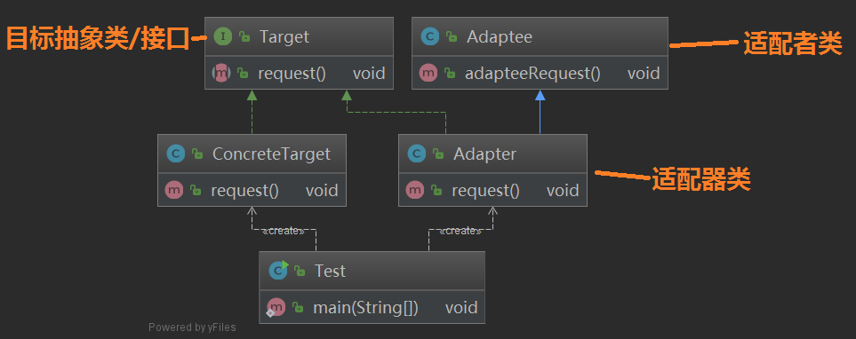
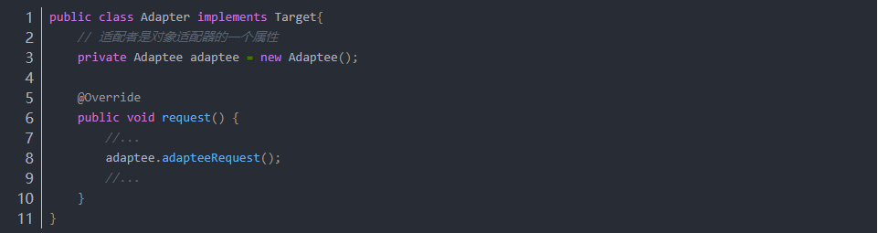
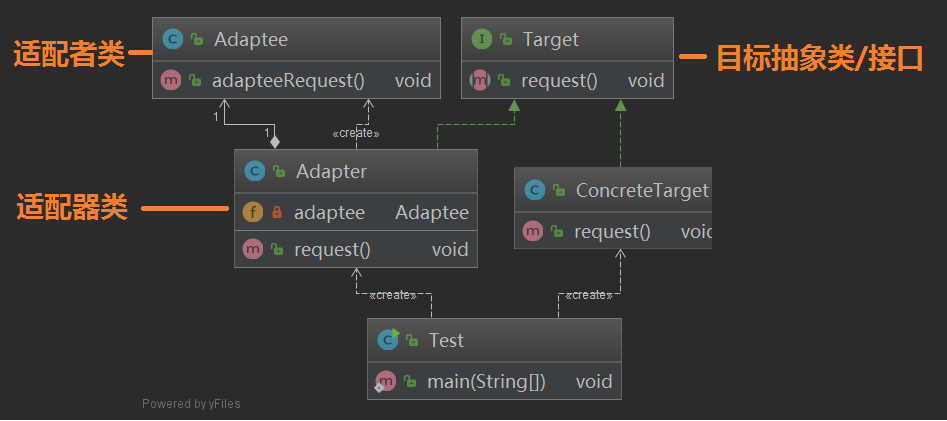
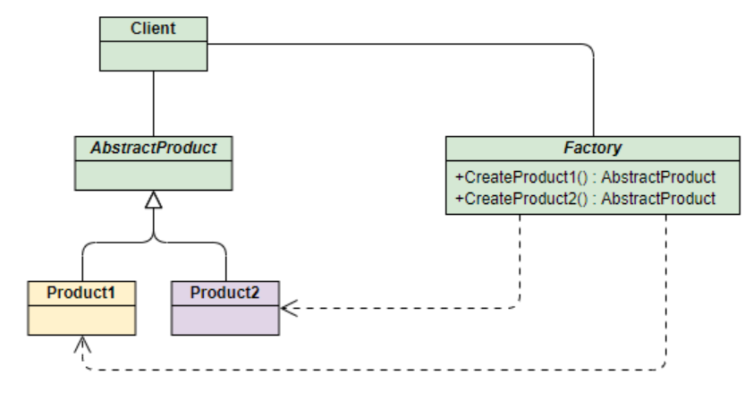
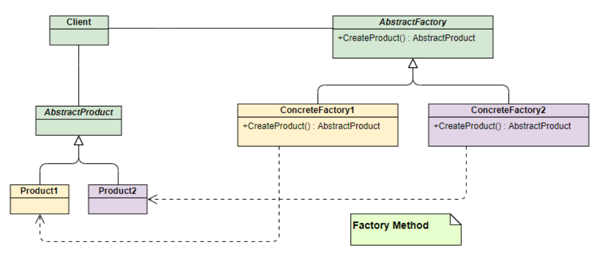
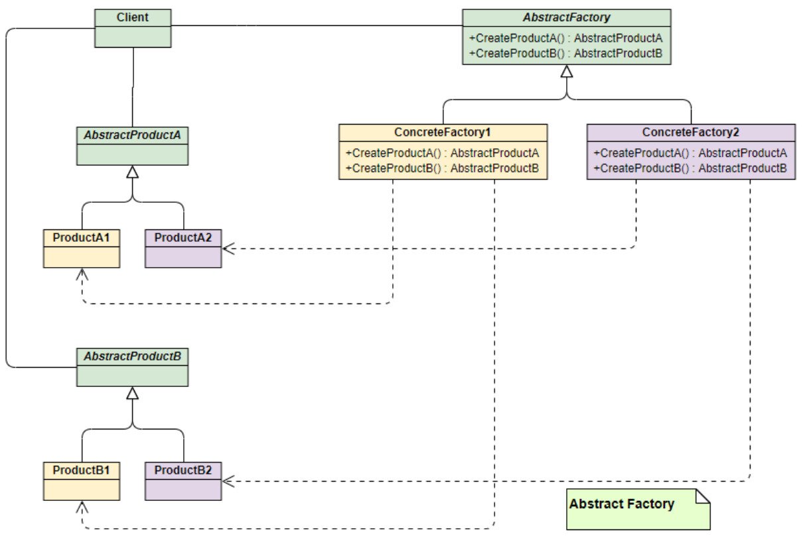
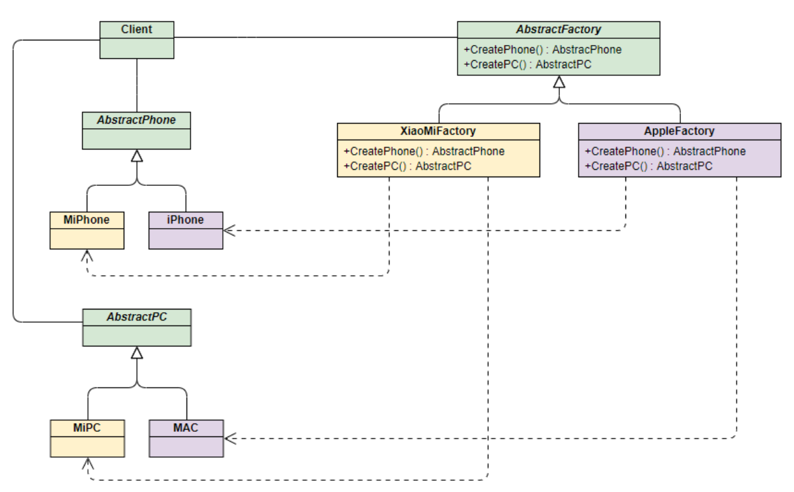
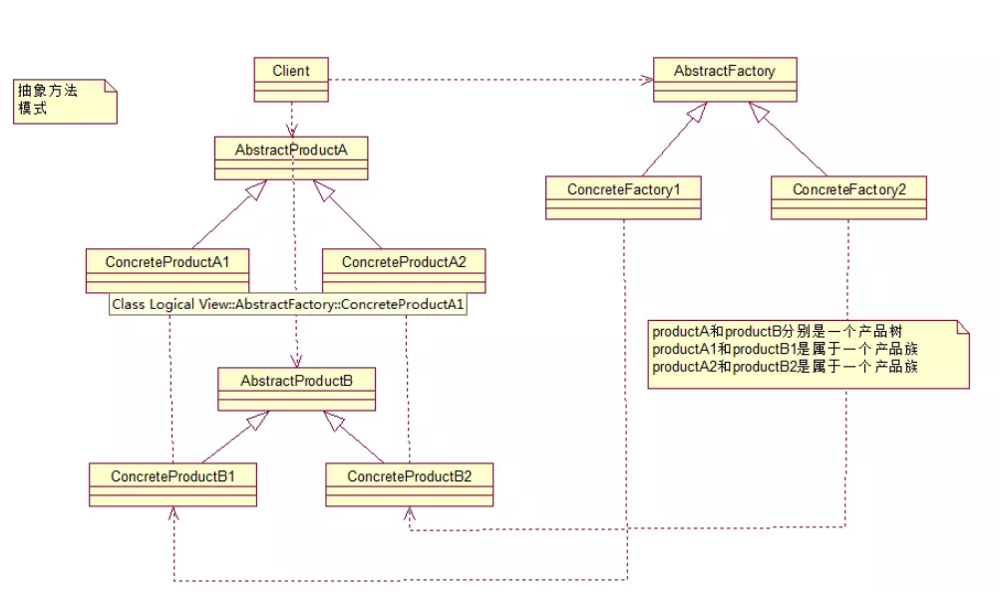

* [88\. 说一下你熟悉的设计模式？](#88-%E8%AF%B4%E4%B8%80%E4%B8%8B%E4%BD%A0%E7%86%9F%E6%82%89%E7%9A%84%E8%AE%BE%E8%AE%A1%E6%A8%A1%E5%BC%8F)
  * [单例模式](#%E5%8D%95%E4%BE%8B%E6%A8%A1%E5%BC%8F)
  * [观察者模式](#%E8%A7%82%E5%AF%9F%E8%80%85%E6%A8%A1%E5%BC%8F)
  * [发布/订阅模式](#%E5%8F%91%E5%B8%83%E8%AE%A2%E9%98%85%E6%A8%A1%E5%BC%8F)
    * [观察者模式和发布\-订阅者模式之间的区别](#%E8%A7%82%E5%AF%9F%E8%80%85%E6%A8%A1%E5%BC%8F%E5%92%8C%E5%8F%91%E5%B8%83-%E8%AE%A2%E9%98%85%E8%80%85%E6%A8%A1%E5%BC%8F%E4%B9%8B%E9%97%B4%E7%9A%84%E5%8C%BA%E5%88%AB)
  * [装饰者模式](#%E8%A3%85%E9%A5%B0%E8%80%85%E6%A8%A1%E5%BC%8F)
  * [适配器模式](#%E9%80%82%E9%85%8D%E5%99%A8%E6%A8%A1%E5%BC%8F)
    * [类适配器](#%E7%B1%BB%E9%80%82%E9%85%8D%E5%99%A8)
    * [对象适配器](#%E5%AF%B9%E8%B1%A1%E9%80%82%E9%85%8D%E5%99%A8)
    * [电压适配器](#%E7%94%B5%E5%8E%8B%E9%80%82%E9%85%8D%E5%99%A8)
    * [spring AOP中的适配器模式](#spring-aop%E4%B8%AD%E7%9A%84%E9%80%82%E9%85%8D%E5%99%A8%E6%A8%A1%E5%BC%8F)
    * [spring MVC中的适配器模式](#spring-mvc%E4%B8%AD%E7%9A%84%E9%80%82%E9%85%8D%E5%99%A8%E6%A8%A1%E5%BC%8F)
  * [工厂模式](#%E5%B7%A5%E5%8E%82%E6%A8%A1%E5%BC%8F)
    * [1\. 简单工厂模式](#1-%E7%AE%80%E5%8D%95%E5%B7%A5%E5%8E%82%E6%A8%A1%E5%BC%8F)
    * [2\. 工厂方法模式(Factory Method)](#2-%E5%B7%A5%E5%8E%82%E6%96%B9%E6%B3%95%E6%A8%A1%E5%BC%8Ffactory-method)
    * [3\. 抽象工厂模式(Abstract Factory)](#3-%E6%8A%BD%E8%B1%A1%E5%B7%A5%E5%8E%82%E6%A8%A1%E5%BC%8Fabstract-factory)
  * [代理模式](#%E4%BB%A3%E7%90%86%E6%A8%A1%E5%BC%8F)
    * [静态代理](#%E9%9D%99%E6%80%81%E4%BB%A3%E7%90%86)
    * [动态代理](#%E5%8A%A8%E6%80%81%E4%BB%A3%E7%90%86)
    * [Cglib代理](#cglib%E4%BB%A3%E7%90%86)
* [89\.简单工厂和抽象工厂有什么区别？](#89%E7%AE%80%E5%8D%95%E5%B7%A5%E5%8E%82%E5%92%8C%E6%8A%BD%E8%B1%A1%E5%B7%A5%E5%8E%82%E6%9C%89%E4%BB%80%E4%B9%88%E5%8C%BA%E5%88%AB)
  * [简单工厂模式；](#%E7%AE%80%E5%8D%95%E5%B7%A5%E5%8E%82%E6%A8%A1%E5%BC%8F)
  * [抽象工厂模式](#%E6%8A%BD%E8%B1%A1%E5%B7%A5%E5%8E%82%E6%A8%A1%E5%BC%8F)
  
## 88. 说一下你熟悉的设计模式？

### 单例模式

简单点说，就是一个应用程序中，某个类的实例对象只有一个，你没有办法去new，因为构造器是被private修饰的，一般通过getInstance()的方法来获取它们的实例。

getInstance()的返回值是一个对象的引用，并不是一个新的实例，所以不要错误的理解成多个对象。


一般来说，单例模式有五种写法：饿汉、懒汉、懒汉双重检验锁、静态内部类、枚举。


### 观察者模式

对象间一对多的依赖关系，当一个对象的状态发生改变时，所有依赖于它的对象都得到通知并被自动更新。

比较概念的解释是，目标和观察者是基类，目标提供维护观察者的一系列方法，观察者提供更新接口。具体观察者和具体目标继承各自的基类，然后具体观察者把自己注册到具体目标里，在具体目标发生变化时候，调度观察者的更新方法。

比如有个“天气中心”的具体目标A，专门监听天气变化，而有个显示天气的界面的观察者B，B就把自己注册到A里，当A触发天气变化，就调度B的更新方法，并带上自己的上下文。


### 发布/订阅模式

比较概念的解释是，订阅者把自己想订阅的事件注册到调度中心，当该事件触发时候，发布者发布该事件到调度中心（顺带上下文），由调度中心统一调度订阅者注册到调度中心的处理代码。

比如有个界面是实时显示天气，它就订阅天气事件（注册到调度中心，包括处理程序），当天气变化时（定时获取数据），就作为发布者发布天气信息到调度中心，调度中心就调度订阅者的天气处理程序。


#### 观察者模式和发布-订阅者模式之间的区别
* **1.Observer模式，观察者是知道Subject主题的，目标主题一直保持对观察者的记录，而publish-subscribe模式中，订阅者和发布者互相不知道对方，通过消息代理进行通信。**
* **2.Observer模式中，观察者和主题之间存在以来耦合关系，而发布订阅者模式则完全松耦合。**
* **3.多数情况下，Observer模式是同步，例如事件触发，而发布-订阅者使用的消息队列模式，大多数处理异步事件。**

### 装饰者模式

对已有的业务逻辑进一步的封装，使其增加额外的功能，如Java中的IO流就使用了装饰者模式，用户在使用的时候，可以任意组装，达到自己想要的效果。


BufferInputStream，LineNumberInputStream都是扩展自抽象的装饰类FileInputStream。


举例说明，咖啡是一种饮料，咖啡的本质是咖啡豆+水磨出来的。咖啡店现在要卖各种口味的咖啡，如果不使用装饰模式，那么在销售系统中，各种不一样的咖啡都要产生一个类，如果有4中咖啡豆，5种口味，那么将要产生至少20个类（不包括混合口味），非常麻烦。使用了装饰模式，只需要11个类即可生产任意口味咖啡（包括混合口味）。

参考designpattern.decorator包下的demo


### 适配器模式

将两种完全不同的事物联系到一起

适配器模式(Adapter Pattern)：将一个接口转换成客户希望的另一个接口，使接口不兼容的那些类可以一起工作，其别名为包装器(Wrapper)。适配器模式既可以作为类结构型模式，也可以作为对象结构型模式。

在适配器模式中，我们通过增加一个新的适配器类来解决接口不兼容的问题，使得原本没有任何关系的类可以协同工作。

根据适配器类与适配者类的关系不同，适配器模式可分为对象适配器和类适配器两种，在对象适配器模式中，适配器与适配者之间是关联关系；在类适配器模式中，适配器与适配者之间是继承（或实现）关系。

* **角色**

* **Target（目标抽象类）：目标抽象类定义客户所需接口，可以是一个抽象类或接口，也可以是具体类。**

* **Adapter（适配器类）：适配器可以调用另一个接口，作为一个转换器，对Adaptee和Target进行适配，适配器类是适配器模式的核心，在对象适配器中，它通过继承Target并关联一个Adaptee对象使二者产生联系。**

* **Adaptee（适配者类）：适配者即被适配的角色，它定义了一个已经存在的接口，这个接口需要适配，适配者类一般是一个具体类，包含了客户希望使用的业务方法，在某些情况下可能没有适配者类的源代码。**

```json
缺省适配器模式(Default Adapter Pattern)：
当不需要实现一个接口所提供的所有方法时，可先设计一个抽象类实现该接口，并为接口中每个方法提供一个默认实现（空方法），
那么该抽象类的子类可以选择性地覆盖父类的某些方法来实现需求，它适用于不想使用一个接口中的所有方法的情况，又称为单接口适配器模式。
缺省适配器模式是适配器模式的一种变体，其应用也较为广泛。在JDK类库的事件处理包java.awt.event中广泛使用了缺省适配器模式，如WindowAdapter、KeyAdapter、MouseAdapter等。
```

示例：

#### 类适配器

举例



怎么才可以在目标接口中的 request() 调用 Adaptee 的 adapteeRequest() 方法呢？

如果通过一个适配器类，实现 Target 接口，同时继承了 Adaptee 类，然后在实现的 request() 方法中调用父类的 adapteeRequest() 即可实现

这样我们即可在新接口 Target 中适配旧的接口或类

#### 对象适配器

对象适配器与类适配器不同之处在于，类适配器通过继承来完成适配，对象适配器则是通过关联来完成，这里稍微修改一下 Adapter 类即可将转变为对象适配器





注意这里的 Adapter 是将 Adaptee 作为一个成员属性，而不是继承它

#### 电压适配器

再来一个好理解的例子，我们国家的民用电都是 220V，日本是 110V，而我们的手机充电一般需要 5V，这时候要充电，就需要一个电压适配器，将 220V 或者 100V 的输入电压变换为 5V 输出

定义输出交流电接口，输出220V交流电类和输出110V交流电类

```java
/**
 * 定义输出交流电接口，输出220V交流电类和输出110V交流电类
 */
public interface AC {
    int outputAC();
}
/**
 * 输出110V交流电类
 */
public class AC110 implements AC {
    public final int output = 110;
    @Override
    public int outputAC() {
        return output;
    }
}
/**
 * 输出220V交流电类
 */
public class AC220 implements AC {
    public final int output = 220;
    @Override
    public int outputAC() {
        return output;
    }
}
```
适配器接口，其中 support() 方法用于检查输入的电压是否与适配器匹配，outputDC5V() 方法则用于将输入的电压变换为 5V 后输出
```java
/**
 * 适配器接口，
 * 其中support()方法用于检查输入的电压是否与适配器匹配，
 * outputDC5V()方法则用于将输入的电压变换成5V后输出
 */
public interface DC5Adapter {
    boolean support(AC ac);
    int outputDC5V(AC ac);
}
```

实现中国变压适配器和日本变压适配器

```java
/**
 * 实现中国变压适配器
 */
public class ChinaPowerAdapter implements DC5Adapter {
    public static final int voltage = 220;
    @Override
    public boolean support(AC ac) {
        return voltage == ac.outputAC();
    }

    @Override
    public int outputDC5V(AC ac) {
        int adapterInput = ac.outputAC();
        //变压器
        int adapterOutput = adapterInput / 44;
        System.out.println("使用ChinaPowerAdapter变压适配器，输入AC：" + adapterInput + "V , 输出DC：" + adapterOutput);
        return adapterOutput;
    }
}
/**
 * 实现日本变压适配器
 */
public class JapanPowerAdapter implements DC5Adapter {
    public static final int voltage = 110;

    @Override
    public boolean support(AC ac) {
        return voltage == ac.outputAC();
    }

    @Override
    public int outputDC5V(AC ac) {
        int adapterInput = ac.outputAC();
        //变压器...
        int adapterOutput = adapterInput/22;
        System.out.println("使用JapanPowerAdapter变压适配器，输入AC：" + adapterInput + "V，输出DC：" + adapterOutput);
        return adapterOutput;
    }
}
```
测试，准备中国变压适配器和日本变压适配器各一个，定义一个方法可以根据电压找到合适的变压器，然后进行测试

```java
public class Test {
    private List<DC5Adapter> adapters = new LinkedList<>();
    public Test() {
        this.adapters.add(new ChinaPowerAdapter());
        this.adapters.add(new JapanPowerAdapter());
    }
    public static void main(String[] args) {
        Test test = new Test();
        AC chinaAC = new AC220();
        DC5Adapter dc5Adapter = test.getPowerAdapter(chinaAC);
        dc5Adapter.outputDC5V(chinaAC);

        //去日本旅游，电压是110V
        AC japanAC = new AC110();
        DC5Adapter dc5Adapter1 = test.getPowerAdapter(japanAC);
        dc5Adapter1.outputDC5V(japanAC);
    }

    //根据电压找合适的变压器
    public DC5Adapter getPowerAdapter(AC ac) {
        DC5Adapter adapter = null;
        for (DC5Adapter dc5Adapter : this.adapters) {
            if (dc5Adapter.support(ac)) {
                adapter = dc5Adapter;
                break;
            }
        }
        if (adapter == null) {
            throw new IllegalArgumentException("没有找到合适的变压适配器");
        }
        return adapter;
    }
}
```
输出
```java
使用ChinaPowerAdapter变压适配器，输入AC：220V , 输出DC：5
使用JapanPowerAdapter变压适配器，输入AC：110V，输出DC：5
```

适配器模式总结

主要优点：

1. 将目标类和适配者类解耦，通过引入一个适配器类来重用现有的适配者类，无须修改原有结构。
2. 增加了类的透明性和复用性，将具体的业务实现过程封装在适配者类中，对于客户端类而言是透明的，而且提高了适配者的复用性，同一个适配者类可以在多个不同的系统中复用。
3. 灵活性和扩展性都非常好，通过使用配置文件，可以很方便地更换适配器，也可以在不修改原有代码的基础上增加新的适配器类，完全符合“开闭原则”。

具体来说，类适配器模式还有如下优点：

* **由于适配器类是适配者类的子类，因此可以在适配器类中置换一些适配者的方法，使得适配器的灵活性更强。**

对象适配器模式还有如下优点：

* **一个对象适配器可以把多个不同的适配者适配到同一个目标；**

* **可以适配一个适配者的子类，由于适配器和适配者之间是关联关系，根据“里氏代换原则”，适配者的子类也可通过该适配器进行适配。**

主要缺点：

* **类适配器模式的缺点如下：**

1. 对于Java、C#等不支持多重类继承的语言，一次最多只能适配一个适配者类，不能同时适配多个适配者；
2. 适配者类不能为最终类，如在Java中不能为final类，C#中不能为sealed类；
3. 在Java、C#等语言中，类适配器模式中的目标抽象类只能为接口，不能为类，其使用有一定的局限性。

* **对象适配器模式的缺点如下：**

  与类适配器模式相比，要在适配器中置换适配者类的某些方法比较麻烦。如果一定要置换掉适配者类的一个或多个方法，可以先做一个适配者类的子类，将适配者类的方法置换掉，然后再把适配者类的子类当做真正的适配者进行适配，实现过程较为复杂。**

适用场景：

* **系统需要使用一些现有的类，而这些类的接口（如方法名）不符合系统的需要，甚至没有这些类的源代码。**

* **想创建一个可以重复使用的类，用于与一些彼此之间没有太大关联的一些类，包括一些可能在将来引进的类一起工作。**

源码分析适配器模式的典型应用

#### spring AOP中的适配器模式

在Spring的Aop中，使用的 Advice（通知） 来增强被代理类的功能。

Advice的类型有：MethodBeforeAdvice、AfterReturningAdvice、ThrowsAdvice

在每个类型 Advice 都有对应的拦截器，MethodBeforeAdviceInterceptor、AfterReturningAdviceInterceptor、ThrowsAdviceInterceptor

Spring需要将每个 Advice 都封装成对应的拦截器类型，返回给容器，所以需要使用适配器模式对 Advice 进行转换

三个适配者类 Adaptee 如下：
```java
public interface MethodBeforeAdvice extends BeforeAdvice {
    void before(Method var1, Object[] var2, @Nullable Object var3) throws Throwable;
}

public interface AfterReturningAdvice extends AfterAdvice {
    void afterReturning(@Nullable Object var1, Method var2, Object[] var3, @Nullable Object var4) throws Throwable;
}

public interface ThrowsAdvice extends AfterAdvice {
}
```

目标接口 Target，有两个方法，一个判断 Advice 类型是否匹配，一个是工厂方法，创建对应类型的 Advice 对应的拦截器

```java
public interface AdvisorAdapter {
    boolean supportsAdvice(Advice var1);

    MethodInterceptor getInterceptor(Advisor var1);
}
```

三个适配器类 Adapter 分别如下，注意其中的 Advice、Adapter、Interceptor之间的对应关系

```java
class MethodBeforeAdviceAdapter implements AdvisorAdapter, Serializable {
	@Override
	public boolean supportsAdvice(Advice advice) {
		return (advice instanceof MethodBeforeAdvice);
	}

	@Override
	public MethodInterceptor getInterceptor(Advisor advisor) {
		MethodBeforeAdvice advice = (MethodBeforeAdvice) advisor.getAdvice();
		return new MethodBeforeAdviceInterceptor(advice);
	}
}

@SuppressWarnings("serial")
class AfterReturningAdviceAdapter implements AdvisorAdapter, Serializable {
	@Override
	public boolean supportsAdvice(Advice advice) {
		return (advice instanceof AfterReturningAdvice);
	}
	@Override
	public MethodInterceptor getInterceptor(Advisor advisor) {
		AfterReturningAdvice advice = (AfterReturningAdvice) advisor.getAdvice();
		return new AfterReturningAdviceInterceptor(advice);
	}
}

class ThrowsAdviceAdapter implements AdvisorAdapter, Serializable {
	@Override
	public boolean supportsAdvice(Advice advice) {
		return (advice instanceof ThrowsAdvice);
	}
	@Override
	public MethodInterceptor getInterceptor(Advisor advisor) {
		return new ThrowsAdviceInterceptor(advisor.getAdvice());
	}
}
```

客户端 DefaultAdvisorAdapterRegistry

```java
public class DefaultAdvisorAdapterRegistry implements AdvisorAdapterRegistry, Serializable {
    private final List<AdvisorAdapter> adapters = new ArrayList(3);

    public DefaultAdvisorAdapterRegistry() {
        // 这里注册了适配器
        this.registerAdvisorAdapter(new MethodBeforeAdviceAdapter());
        this.registerAdvisorAdapter(new AfterReturningAdviceAdapter());
        this.registerAdvisorAdapter(new ThrowsAdviceAdapter());
    }
    
    public MethodInterceptor[] getInterceptors(Advisor advisor) throws UnknownAdviceTypeException {
        List<MethodInterceptor> interceptors = new ArrayList(3);
        Advice advice = advisor.getAdvice();
        if (advice instanceof MethodInterceptor) {
            interceptors.add((MethodInterceptor)advice);
        }

        Iterator var4 = this.adapters.iterator();

        while(var4.hasNext()) {
            AdvisorAdapter adapter = (AdvisorAdapter)var4.next();
            if (adapter.supportsAdvice(advice)) {   // 这里调用适配器方法
                interceptors.add(adapter.getInterceptor(advisor));  // 这里调用适配器方法
            }
        }

        if (interceptors.isEmpty()) {
            throw new UnknownAdviceTypeException(advisor.getAdvice());
        } else {
            return (MethodInterceptor[])interceptors.toArray(new MethodInterceptor[0]);
        }
    }
    // ...省略...
}
```

这里看 while 循环里，逐个取出注册的适配器，调用 supportsAdvice() 方法来判断 Advice 对应的类型，然后调用 getInterceptor() 创建对应类型的拦截器


这里应该属于对象适配器模式，关键字 instanceof 可看成是 Advice 的方法，不过这里的 Advice 对象是从外部传进来，而不是成员属性

#### spring MVC中的适配器模式

Spring MVC中的适配器模式主要用于执行目标Controller中的请求处理方法。

在Spring MVC中，DispatcherServlet作为用户，HandlerAdapter作为期望接口，具体的适配器实现类用于对目标类进行适配，Controller作为需要适配的类。

为什么要在 Spring MVC 中使用适配器模式？Spring MVC 中的 Controller 种类众多，不同类型的 Controller 通过不同的方法来对请求进行处理。如果不利用适配器模式的话，DispatcherServlet 直接获取对应类型的 Controller，需要的自行来判断，像下面这段代码一样：

```java
if(mappedHandler.getHandler() instanceof MultiActionController){  
   ((MultiActionController)mappedHandler.getHandler()).xxx  
}else if(mappedHandler.getHandler() instanceof XXX){  
    ...  
}else if(...){  
   ...  
}
```

这样假设如果我们增加一个 HardController,就要在代码中加入一行 if(mappedHandler.getHandler() instanceof HardController)，这种形式就使得程序难以维护，也违反了设计模式中的开闭原则 – 对扩展开放，对修改关闭。

我们来看看源码，首先是适配器接口 HandlerAdapter

```java
public interface HandlerAdapter {
    boolean supports(Object var1);

    ModelAndView handle(HttpServletRequest var1, HttpServletResponse var2, Object var3) throws Exception;

    long getLastModified(HttpServletRequest var1, Object var2);
}
```

现该接口的适配器每一个 Controller 都有一个适配器与之对应，这样的话，每自定义一个 Controller 需要定义一个实现 HandlerAdapter 的适配器。

springmvc 中提供的 Controller 实现类有如下


springmvc 中提供的 HandlerAdapter 实现类如下


HttpRequestHandlerAdapter 这个适配器代码如下

```java
public class HttpRequestHandlerAdapter implements HandlerAdapter {
    public HttpRequestHandlerAdapter() {
    }

    public boolean supports(Object handler) {
        return handler instanceof HttpRequestHandler;
    }

    public ModelAndView handle(HttpServletRequest request, HttpServletResponse response, Object handler) throws Exception {
        ((HttpRequestHandler)handler).handleRequest(request, response);
        return null;
    }

    public long getLastModified(HttpServletRequest request, Object handler) {
        return handler instanceof LastModified ? ((LastModified)handler).getLastModified(request) : -1L;
    }
}
```

当Spring容器启动后，会将所有定义好的适配器对象存放在一个List集合中，当一个请求来临时，DispatcherServlet 会通过 handler 的类型找到对应适配器，并将该适配器对象返回给用户，然后就可以统一通过适配器的 hanle() 方法来调用 Controller 中的用于处理请求的方法。

```java
public class DispatcherServlet extends FrameworkServlet {
    private List<HandlerAdapter> handlerAdapters;
    
    //初始化handlerAdapters
    private void initHandlerAdapters(ApplicationContext context) {
        //..省略...
    }
    
    // 遍历所有的 HandlerAdapters，通过 supports 判断找到匹配的适配器
    protected HandlerAdapter getHandlerAdapter(Object handler) throws ServletException {
		for (HandlerAdapter ha : this.handlerAdapters) {
			if (logger.isTraceEnabled()) {
				logger.trace("Testing handler adapter [" + ha + "]");
			}
			if (ha.supports(handler)) {
				return ha;
			}
		}
	}
	
	// 分发请求，请求需要找到匹配的适配器来处理
	protected void doDispatch(HttpServletRequest request, HttpServletResponse response) throws Exception {
		HttpServletRequest processedRequest = request;
		HandlerExecutionChain mappedHandler = null;

		// Determine handler for the current request.
		mappedHandler = getHandler(processedRequest);
			
		// 确定当前请求的匹配的适配器.
		HandlerAdapter ha = getHandlerAdapter(mappedHandler.getHandler());

		ha.getLastModified(request, mappedHandler.getHandler());
					
		mv = ha.handle(processedRequest, response, mappedHandler.getHandler());
    }
	// ...省略...
}
```

通过适配器模式我们将所有的 controller 统一交给 HandlerAdapter 处理，免去了写大量的 if-else 语句对 Controller 进行判断，也更利于扩展新的 Controller 类型。

### 工厂模式

工厂顾名思义就是创建产品，根据产品是具体产品还是具体工厂可分为简单工厂模式和工厂方法模式，根据工厂的抽象程度可分为工厂方法模式和抽象工厂模式。

该模式用于封装和管理对象的创建，是一种创建型模式。

#### 1. 简单工厂模式

该模式对对象创建管理方式最为简单，因为其仅仅简单的对不同类对象的创建进行了一层薄薄的封装。该模式通过向工厂传递类型来指定要创建的对象，其UML类图如下：



#### 2. 工厂方法模式(Factory Method)

和简单工厂模式中工厂负责生产所有产品相比，工厂方法模式将生成具体产品的任务分发给具体的产品工厂，其UML类图如下：



也就是定义一个抽象工厂，其定义了产品的生产接口，但不负责具体的产品，将生产任务交给不同的派生类工厂。这样不用通过指定类型来创建对象了。

接下来继续使用生产手机的例子来讲解该模式。

其中和产品相关的Phone类、MiPhone类和IPhone类的定义不变。

AbstractFactory类：生产不同产品的工厂的抽象类

```java
public interface AbstractFactory {
    Phone makePhone();
}
```

XiaoMiFactory类：生产小米手机的工厂（ConcreteFactory1）

```java
public class XiaoMiFactory implements AbstractFactory{
    @Override
    public Phone makePhone() {
        return new MiPhone();
    }
}
```

AppleFactory类：生产苹果手机的工厂（ConcreteFactory2）

```java
public class AppleFactory implements AbstractFactory {
    @Override
    public Phone makePhone() {
        return new IPhone();
    }
}
```

演示：

```java
public class Demo {
    public static void main(String[] arg) {
        AbstractFactory miFactory = new XiaoMiFactory();
        AbstractFactory appleFactory = new AppleFactory();
        miFactory.makePhone();            // make xiaomi phone!
        appleFactory.makePhone();        // make iphone!
    }
}
```

#### 3. 抽象工厂模式(Abstract Factory)

上面两种模式不管工厂怎么拆分抽象，都只是针对一类产品Phone（AbstractProduct），如果要生成另一种产品PC，应该怎么表示呢？

最简单的方式是把2中介绍的工厂方法模式完全复制一份，不过这次生产的是PC。但同时也就意味着我们要完全复制和修改Phone生产管理的所有代码，显然这是一个笨办法，并不利于扩展和维护。

抽象工厂模式通过在AbstarctFactory中增加创建产品的接口，并在具体子工厂中实现新加产品的创建，当然前提是子工厂支持生产该产品。否则继承的这个接口可以什么也不干。

其UML类图如下：



从上面类图结构中可以清楚的看到如何在工厂方法模式中通过增加新产品接口来实现产品的增加的。

接下来我们继续通过小米和苹果产品生产的例子来解释该模式。

为了弄清楚上面的结构，我们使用具体的产品和工厂来表示上面的UML类图，能更加清晰的看出模式是如何演变的：



总结：

上面介绍的三种工厂模式有各自的应用场景，实际应用时能解决问题满足需求即可，可灵活变通，无所谓高级与低级。

此外无论哪种模式，由于可能封装了大量对象和工厂创建，新加产品需要修改已定义好的工厂相关的类，因此对于产品和工厂的扩展不太友好，利弊需要权衡一下。

### 代理模式

代理模式有多种不同的实现方式。如果按照代理创建的时期来进行分类：静态代理、动态代理

* **静态代理**

由程序员创建或特定工具自动生成源代码，再对其进行编译。在程序运行之前，代理类.class文件就已经被创建，代理类和委托类的关系在运行前就确定。

* **动态代理**

动态代理类的源码是在程序运行期间由JVM根据反射等机制动态的生成，所以不存在代理类的字节码文件。代理类和委托类的关系是在程序运行时确定。

#### 静态代理

1.抽象主题类

```java
public interface Subject {
    /**
     * 接口方法
     */
    public void request();
}
```

2.具体主题类

```java
public class ConcreteSubject implements Subject {
    /**
     * 具体的业务逻辑实现
     */
    @Override
    public void request() {
        //业务处理逻辑
    }
}
```

3.代理类

```java
public class Proxy implements Subject {
    //要代理的实现类
    private Subject subject;

    public Proxy(Subject subject) {
        this.subject = subject;
    }

    @Override
    public void request() {
        this.before();
        this.subject.request();
        this.after();
    }
    //预处理
    private void before() {
        System.out.println("预处理...");
    }
    //后处理
    private void after() {
        System.out.println("后处理...");
    }
}
```

4.客户端类

```java
public class Client {
    public static void main(String[] args) {
        Subject subject = new ConcreteSubject();
        Proxy proxy = new Proxy(subject);
        proxy.request();
    }
}
```

静态代理优缺点

* **优点**

  业务类只需要关注业务逻辑本身，保证了业务类的重用性。这是代理的共有优点。

  代理使客户端不需要知道实现类是什么，怎么做的，而客户端只需要知道代理即可（解耦合）。

* **缺点**

  代理类和委托类实现了相同的接口，代理类通过委托类实现了相同的方法。这样就出现了大量的代码重复。
  如果接口增加一个方法，除了所有实现类需要实现这个方法外，所有代理类也需要实现此方法，增加了代码维护的复杂度。
  
  代理对象只服务于一种类型的对象，如果要服务多类型的对象，势必要为每一种对象都进行代理，静态代理在程序规模稍大时就无法胜任了。实例代码只是为Subject类的访问提供了代理，但是如果还要为其他类如AnotherSubject类提供代理的话，就需要我们再次添加代理AnotherSubject的代理类。
  
  由于静态代理的这个缺点，就需要使用动态代理。
  
#### 动态代理

从静态代理会发现——每个代理类只能为一个接口服务，这样程序开发中必然会产生许多的代理类。所以我们想办法通过一个代理类完成全部的代理功能，那么我们就需要用动态代理。

在上面的示例中，一个代理只能代理一种类型（一个接口），而且是在编译期就已经确定被代理的对象。而动态代理是在运行时，通过反射机制实现动态代理，并且能够代理各种各样的对象。

在Java中要想实现动态代理机制，需要java.lang.reflect.InvocationHandler接口和java.lang.reflect.Proxy类的支持。

1.动态创建代理对象的类

动态代理类只能代理接口（不支持抽象类），代理类都需要实现InvocationHandler类，实现invoke()方法。invoke()方法就是调用被代理接口的所有方法时需要调用的，返回的值是被代理接口的一个实现类。

```java
public class ProxyHandler implements InvocationHandler {
    //目标对象
    private Object target;

    /**
     * 绑定关系，也就是关联到哪个接口（与具体的实现类绑定）的哪些方法将被调用时，执行invoke()方法。
     * @param target 绑定具体的代理实例
     * @return 动态代理类实例
     */
    public Object newProxyInstance(Object target) {
        this.target = target;
        /*
        该方法用于为指定类装载器、一组接口及调用处理器生成动态代理类实例。
        第一个参数指定产生代理对象的类加载器，需要将其指定为和目标对象同一个类加载器。
        第二个参数要实现和目标对象一样的接口，所以只需要拿到目标对象的实现接口。
        第三个参数表明这些被拦截的方法在被拦截时需要执行哪个InvocationHandler的invoke方法。
        根据传入的目标返回一个代理对象
         */
        Object result = Proxy.newProxyInstance(target.getClass().getClassLoader(), target.getClass().getInterfaces(), this);
        return result;
    }

    /**
     * 关联的这个实现类的方法被调用时将被执行。InvocationHandler接口的方法。
     * @param proxy 代理
     * @param method 原对象被调用的方法
     * @param args 方法的参数
     * @return
     * @throws Throwable
     */
    @Override
    public Object invoke(Object proxy, Method method, Object[] args) throws Throwable {
        //TODO 原对象方法调用前添加的预处理逻辑
        System.out.println("预处理...");
        Object result = null;
        //调用目标方法
        result = method.invoke(target, args);
        //TODO 原对象方法调用后添加的后处理逻辑
        System.out.println("后处理...");
        //返回的值是被代理接口的一个实现类
        return result;
    }
}
```

被代理对象target通过参数传递进来，我们通过target.getClass().getClassLoader()获取ClassLoader对象，然后通过target.getClass().getInterfaces()获取它实现的所有接口，然后将target包装到实现了InvocationHandler接口的ProxyHandler实现对象中。通过newProxyInstance函数我们就获得了一个动态代理对象。

2.客户端类

```java
public class Client {
    public static void main(String[] args) {
        ProxyHandler proxyHandler = new ProxyHandler();
        Subject subject = (Subject) proxyHandler.newProxyInstance(new ConcreteSubject());
        subject.request();
    }
}
```

可以看到，我们可以通过ProxyHandler代理不同类型的对象，如果我们把对外的接口都通过动态代理来实现，那么所有的函数调用最终都会经过invoke函数的转发，因此我们就可以在这里做一些自己想做的操作，比如日志系统、事务、拦截器、权限控制等。

当前非常流行的面向切面的编程（Aspect Oriented Programming，AOP），其核心就是动态代理机制。

* **备注：**

要实现动态代理的首要条件：被代理类必须实现一个接口，才能被代理。

（现在还有CGLIB可以实现不用实现接口也可以实现动态代理）

* **动态代理的优缺点**

* **优点**

动态代理与静态代理相比较，最大的好处是接口中声明的所有方法都被转移到调用处理器一个集中的方法中处理（InvocationHandler.invoke）。这样，在接口方法数量比较多的时候，我们可以进行灵活处理，而不需要像静态代理那样每一个方法进行中转。而且动态代理的应用使我们的类职责更加单一，复用性更强。

* **缺点**

Proxy已经设计得非常优美，但是还有有一点点小小的遗憾之处——它始终无法摆脱仅支持interface代理的桎梏，因为它的设计注定了这个遗憾。动态生成的代理类的继承关系图，已经注定有一个共同的父类叫Proxy。Java的继承机制注定了这些动态代理类们无法实现对class的动态代理，原因是多继承在Java中本质上就行不通。

#### Cglib代理

上面的静态代理和动态代理模式有个相同点就是都要求目标对象是实现一个接口的对象,然而并不是任何对象都会实现一个接口，也存在没有实现任何的接口的对象,

这时就可以使用继承目标类以目标对象子类的方式实现代理,这种方法就叫做:Cglib代理，也叫作子类代理,它是在内存中构建一个子类对象从而实现对目标对象功能的扩展.

由于Cglib是第三方提供的所以使用的时候需要导入相关的jar包，有两个包如图：


代理类：
```java
public class CglibProxy {
    public static Object newProxyInstance(Object target) {
        //实例化一个增强器，也就是cglib中的一个class generator
        Enhancer enhancer = new Enhancer();
        //设置目标类
        enhancer.setSuperclass(target.getClass());
        //设置拦截对象，这里直接使用匿名内部类写法
        enhancer.setCallback(new MethodInterceptor() {
            @Override
            public Object intercept(Object object, Method method, Object[] args, MethodProxy methodProxy) throws Throwable {
                //TODO 原对象方法调用前添加的预处理逻辑
                String sortName = method.getName();
                long start = System.currentTimeMillis();

                //此处一定要用proxy的invokeSuper方法来调用目标类的方法
                methodProxy.invokeSuper(object, args);

                //TODO 原对象方法调用后添加的后处理逻辑
                long end = System.currentTimeMillis();
                System.out.println("本次" + sortName + "的执行时间为：" + (end - start) + "ms");
                return null;
            }
        });
        //生成代理类并返回一个实例
        return enhancer.create();
    }
}
```

目标类：
```java
public class ArraySort2 {
    public void quickSort(int[] arr) {
        Arrays.sort(arr);
        System.out.println("快速排序执行完毕");
    }
    public void selectSort(int[] arr) {
        for (int i = 0; i < arr.length - 1; i++) {
            int index = i;
            //找出最小值的元素下标
            for (int j = i + 1; j < arr.length; j++) {
                if (arr[j] < arr[index]) {
                    index = j;
                }
            }
            int temp = arr[index];
            arr[index] = arr[i];
            arr[i] = temp;
        }
        System.out.println("选择排序执行完毕");
    }
    public void bubbleSort(int[] arr) {
        for (int i = 0; i < arr.length - 1; i++) {
            for (int j = 0; j < arr.length - 1 - i; j++) {
                int temp = 0;
                if (arr[j] > arr[j+1]) {
                    temp = arr[j];
                    arr[j] = arr[j+1];
                    arr[j+1] = temp;
                }
            }
        }
        System.out.println("冒泡排序执行完毕");
    }
 }
```


测试类：
```java
public class Client {
    public static void main(String[] args) {
        int[] arr = new int[100000];
        for (int i = 0; i < arr.length; i++) {
            arr[i] = (int) Math.random() * 1000;
        }
        ArraySort2 arraySort2 = (ArraySort2) CglibProxy.newProxyInstance(new ArraySort2());
        arraySort2.bubbleSort(arr);
        arraySort2.selectSort(arr);
        arraySort2.quickSort(arr);
    }
}
```

* **总结：**

在Spring的AOP编程中：

如果加入容器的目标对象有实现接口，用JDK代理

如果目标对象没有实现接口，用Cglib代理

## 89.简单工厂和抽象工厂有什么区别？

### 简单工厂模式；

这个模式本身很简单而且使用在业务较简单的情况下，一般用于小项目或者具体产品很少扩展的情况（这样工厂类才不用经常更改）。

它由三种角色组成：

* **工厂类角色** 

  这是本模式的核心，含有一定的商业逻辑和判断逻辑，根据逻辑不同，产生具体的工厂产品，如例子中的PhoneFactory类。
  
* **抽象产品角色**

  它一般是具体产品继承的父类或者实现的接口，由接口或者抽象类来实现。如例子中的Phone接口。
  
* **具体产品角色**

  工厂类所创建的对象就是此角色的实例，在java中由一个具体类实现，如例子中的IPhone和MiPhone类。
  
来用类图清晰地表示下它们之间的关系：


### 抽象工厂模式

抽象工厂模式是工厂方法模式的升级版本，工厂方法模式只生产一个等级的产品，而抽象工厂模式可生产同一类不同等级的产品。

即：一个工厂方法实现只能生产一种产品，手机或者电脑，但是一个抽象工厂实现可以同时生产手机和电脑，此时可以认为生产的都是一个牌子的产品，例如：苹果的手机和电脑，该工厂就是苹果的生产工厂。

先来认识下什么是产品族：位于不同产品等级结构中，功能相关联的产品组成的家族。



对比抽象工厂示例的图：


例子中的PC和Phone就是两个产品树，而如图所示的MiPhone和MiPC就是一个产品族，它们都可以放到XiaoMiFactory中，因此功能有所关联。

可以这么说，它和工厂方法模式的区别就在于需要创建对象的复杂程度上，而且抽象工厂模式是三个里面最为抽象、最具一般性的。

抽象工厂模式的用意为：给客户端提供一个接口，可以创建多个产品族中的产品对象。

而且使用抽象工厂模式一般要满足以下条件：

  1. 系统中有多个产品族，每个具体工厂创建同一族但属于不同等级的产品。
  
  2. 系统一次只可能消费其中某一族产品，即同族的产品一起使用。

抽象工厂模式除了具有工厂方法模式的优点外，其他主要优点如下：

  1. 可以在类的内部对产品族中相关联的多种产品共同管理，而不必专门引入多个新的类来进行管理。
  2. 当增加一个新的产品族时不需要修改原代码，满足开闭原则。
  
其缺点是：当产品族中需要增加一个新的产品时，所有的工厂类都需要进行修改。

来看看抽象工厂模式的各个角色（和工厂方法的如出一辙）：

* **抽象工厂角色：** 这是工厂方法模式的核心，它与应用程序无关，是具体工厂角色必须实现的接口或者必须继承的父类，在java中它由抽象类或者接口来实现。
* **具体工厂角色：** 它含有和具体业务逻辑有关的代码。由应用程序调用以创建对应的具体产品的对象。在java中它由具体的类来实现。
* **抽象产品角色：** 它是具体产品继承的父类或者是实现的接口。在java中一般由抽象类或者接口来实现。
* **具体产品角色：** 具体工厂角色所创建的对象就是此角色的实例。在java中由具体的类来实现。

