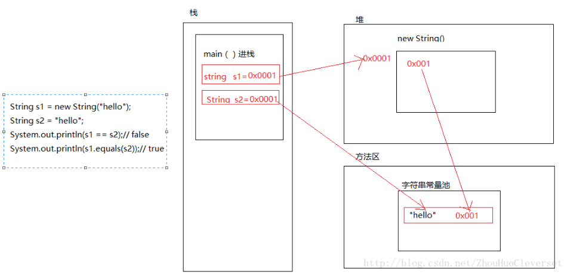

[TOC]
=================

* [目录](#%E7%9B%AE%E5%BD%95)
  * [question](#question)
  * [1、JDK和JRE有什么区别？](#1jdk%E5%92%8Cjre%E6%9C%89%E4%BB%80%E4%B9%88%E5%8C%BA%E5%88%AB)
  * [2、==和equals的区别是什么？](#2%E5%92%8Cequals%E7%9A%84%E5%8C%BA%E5%88%AB%E6%98%AF%E4%BB%80%E4%B9%88)
    * [==解读：](#%E8%A7%A3%E8%AF%BB)
    * [equals解读：](#equals%E8%A7%A3%E8%AF%BB)

## 1、JDK和JRE有什么区别？
JDK：Java Development Kit的简称，java开发工具包，提供了java的开发环境和运行环境；

JRE：Java Runtime Environment的简称，java运行环境，为java的运行提供了所需环境；

JDK其实包含了JRE，同时还包含了编译java源码的编译器javac，还包含了很多java程序调试和分析的工具；
简单来说：如果你要运行java程序，只需安装JRE就行了，如果你需要编写java程序，需要安装JDK；

## 2、==和equals的区别是什么？
### ==解读：
对于基本类型和引用类型，==的作用效果是不同的，如下所示：
* **基本类型：比较的是值是否相同；**
* **引用类型：比较的是引用是否相同；**
代码示例：
```java
String x = "string";
String y = "string";
String z = new String("string");
System.out.println(x==y); //true
System.out.println(x==z); //false
System.out.println(x.equals(y)); //true
System.out.println(x.equals(z)); //true
```
代码解读：因为x和y指向的是同一个引用，所以==也是true，而new String()方法则重写开辟了内存空间，所以==结果为false，而equals比较的一直是值，所以结果都为true；
### equals解读：
equals本质上就是==，只不过String和Integer等重写了equals方法，把它变成了值比较；
equals源码：
```java
public boolean equals(Object obj) {
  return (this == obj);
}
```
首先来看默认情况下equals比较一个有相同值的对象，代码如下：
```java
class Cat {
  public Cat(String name) {
    this.name = name;
  }
  private String name;
  public String getName() { return name;}
  public void setName(String name) {this.name = name;}
}

Cat c1 = new Cat("miaomi");
Cat c2 = new Cat("miaomi");
System.out.println(c1.equals(c2)); //false
```
输出结果是false;
即：比较普通对象时，equals比较的是引用，所以不同，而比较String和Integer等类型时，因为重写了equals方法，变成了值比较，也就相同了；

总结：

    ==对于基本类型来说是值比较，对于引用类型来说比较的是引用；
    equals默认情况下是引用比较，只是很多类重写了equals方法，比如String、Integer等把它变成了值比较，所以一般情况下equals比较的是值是否相等；
举例：
```java
public class StringDemo2 {
    public static void main(String[] args) {
        String s1 = new String("hello");
        String s2 = "hello";
        System.out.println(s1 == s2);// false
        System.out.println(s1.equals(s2));// true
    }
}
**运行结果：**
> false 
> true
```
代码详解

1. 首先，通过main（）方法进栈。
2. 然后再栈中定义一个对象s1,去堆中开辟一个内存空间，将内存空间的引用赋值给s1，“hello”是常量，然后去字符串常量池 查看是否有hello字符串对象，没有的话分配一个空间存放hello，并且将其空间地址存入堆中new出来的空间中。
3. 在栈中定义一个对象s2，然后去字符串常量池中查看是否有”hello”字符串对象，有，直接把”hello”的地址赋值给s2.
4. 即s1中存的是堆中分配的空间，堆中分配的空间中存的是字符串常量池中分配空间存放”hello”的空间的地址值。而s2中之间存的是字符串常量池中分配空间存放”hello”的空间的地址值。
5. 由于s1与s2中存放的地址不同，所以输出false。因为，类String重写了equals()方法，它比较的是引用类型的 的值是否相等，所以输出true。即结果为false、true。

<span id="jump"></span>

## 3、两个对象的hashCode()相同，则equals()也一定为true，对吗？
```java
String str1 = "通话";
String str2 = "重地";
System.out.println(String.format("str1：%d | str2：%d", str1.hashCode(),str2.hashCode()));
System.out.println(str1.equals(str2));
```
执行的结果：
```java
str1：1179395 | str2：1179395
false
```
代码解读：很显然“通话”的“重地”的hashCode()相同，然而equals()则为false，

hashCode(方法)是jdk根据对象的地址或者字符串或者数字算出来的int类型的数值；

而equals()是Object中的方法,默认返回==的比较值，相当于两对象之间的属性（成员变量）“相等”，意即具有相同的行为（方法）；

结论：两个对象equals为真，那么hashcode一定相同；反之，两个对象的hashcode相同，但是equals不一定为真；

## 4、final在java中有什么作用？
* **final修饰的类叫最终类，该类不能被继承；**
* **final修饰的方法不能被重写；**
* **final修饰的变量叫常量，常量必须初始化，且值不能被修改；**

## 5、java中的Math.round(-1.5)等于多少？
等于-1，因为在数轴上取值时，中间值（0.5）向右取整，所以正0.5是往上取整，-0.5是直接舍弃；

## 6、String属于基础的数据类型吗？
String不属于基础类型，基础类型有8种，byte，short，int，long，float，double，boolean，char，而String属于对象；

## 7、java中操作字符串都有哪些类？他们之间有什么区别？
操作字符串的类有：String、StringBuffer、StringBuilder。

区别在于：

String声明的是不可变的对象，每次操作都会生成新的String对象，然后将指针指向新的String对象；

而StringBuffer和StringBuilder，可以在原有对象的基础上进行操作，所以在经常改变字符串内容的情况下最好不要使用String；

StringBuffer和StringBuilder最大的区别在于，StringBuffer是线程安全的，而StringBuilder是非线程安全的，而StringBuilder的性能却高于StringBuffer；

所以，在单线程环境下推荐使用StringBuilder，多线程环境下推荐使用StringBuffer；

## 8、String str = "i" 与String str = new String("i")一样吗？
不一样，因为内存的分配方式不一样。

String str = "i"的方式，java虚拟机会将其分配到常量池中；

而String str = new String("i")则会被分到堆内存中；

图片可以参考[点击此处跳转](#jump)

## 9、如何将字符串反转？
使用StringBuffer或者StringBuilder的reverse()方法；
实例代码：
```java
//StringBuffer reverse
StringBuffer stringBuffer = new StringBuffer();
stringBuffer.append("abcdefg");
System.out.println(stringBuffer.reverse()); //gfedcba
//StringBuilder reverse
String Builder stringBuilder = new StringBuilder();
stringBuilder.append("abcdefg");
System.out.println(stringBuilder.reverse()); //gfedcba
```

## 10、String类的常用方法都有哪些？
* **indexOf()：返回指定字符的索引**
* **charAt()：返回指定索引处的字符**
* **replace()：字符串替换**
* **trim()：去除字符串两端空白**
* **split()：分割字符串，返回一个分割后的字符串数组**
* **getBytes()：返回字符串的 byte 类型数组**
* **length()：返回字符串长度**
* **toLowerCase()：将字符串转成小写字母**
* **toUpperCase()：将字符串转成大写字符**
* **substring()：截取字符串**
* **equals()：字符串比较**

## 11、 抽象类必须要有抽象方法吗？
不需要，抽象类不一定非要有抽象方法
示例代码：
```java
abstract class Cat {
  public static void sayHi() {
    System.out.println("hi~");
  }
}
```
上面代码，抽象类并没有抽象方法但完全可以正常运行。

## 12、普通类和抽象类有哪些区别？
* **普通类没有抽象方法**
* **抽象类不能直接实例化**

## 13、抽象类能使用 final 修饰吗？
不能，定义抽象类就是让其他类继承的，如果定义为final该类就不能被继承，编辑器也会提示错误信息；

## 14、接口和抽象类有什么区别？
* **实现：抽象类的子类使用extends来继承，接口必须使用implements来实现接口**
* **声明：接口里面只能对方法进行声明，抽象类既可以对方法进行声明也可以对方法进行实现** 

      1.抽象类里面的抽象方法必须全部被子类实现，如果子类不能全部实现，那么子类必须也是抽象类。
      接口里面的方法也必须全部被子类实现，如果子类不能实现那么子类必须是抽象类。

      2.接口里面的方法只能声明，不能有具体的实现。这说明接口是设计的结果，抽象类是重构的结果。
* **构造函数：抽象类可以有构造函数，接口不能有**
* **main 方法：抽象类可以有 main 方法，并且我们能运行它；接口不能有 main 方法**
* **实现数量：类可以实现很多接口，但只能继承一个抽象类**
* **访问修饰符：接口中的方法默认使用 public 修饰；抽象类中的方法可以是任意访问修饰符**
* ****

## 15、java 中 IO 流分为几种？
按功能来分：输入流（input）、输出流（output）

按类型来分：字节流和字符流

字节流和字符流的区别是：字节流按8位传输以字节为单位输入输出数据，字符流按16位传输以字符为单位输入输出数据。

## 16、BIO、NIO、AIO 有什么区别？
* **BIO：Block IO 同步阻塞式 IO，就是我们平常使用的传统 IO，它的特点是模式简单使用方便，并发处理能力低。**
* **NIO：New IO 同步非阻塞 IO，是传统 IO 的升级，客户端和服务器端通过 Channel（通道）通讯，实现了多路复用。**
* **AIO：Asynchronous IO 是 NIO 的升级，也叫 NIO2，实现了异步非堵塞 IO ，异步 IO 的操作基于事件和回调机制。**

## 17、 Files的常用方法都有哪些？
* **Files.exists()：检测文件路径是否存在**
* **Files.createFile()：创建文件**
* **Files.createDirectory()：创建文件夹**
* **Files.delete()：删除一个文件或目录**
* **Files.copy()：复制文件**
* **Files.move()：移动文件**
* **Files.size()：查看文件个数**
* **Files.read()：读取文件**
* **Files.write()：写入文件**
