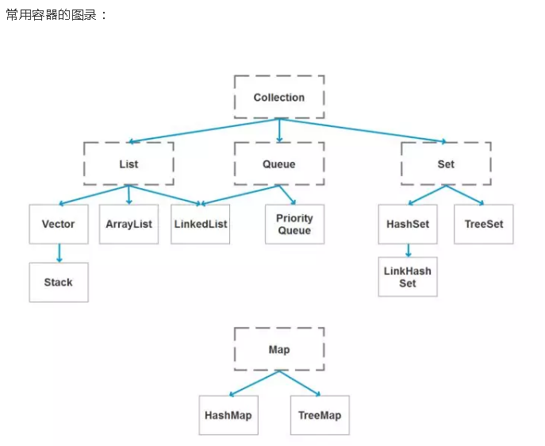
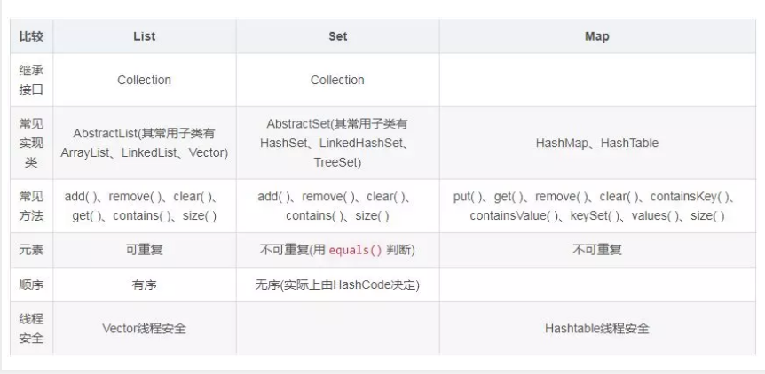

=================

* [18\. java 容器都有哪些？](#18-java-%E5%AE%B9%E5%99%A8%E9%83%BD%E6%9C%89%E5%93%AA%E4%BA%9B)
* [19\. Collection 和 Collections 有什么区别？](#19-collection-%E5%92%8C-collections-%E6%9C%89%E4%BB%80%E4%B9%88%E5%8C%BA%E5%88%AB)
* [20、List、Set、Map之间的区别是什么？](#20listsetmap%E4%B9%8B%E9%97%B4%E7%9A%84%E5%8C%BA%E5%88%AB%E6%98%AF%E4%BB%80%E4%B9%88)
* [21、 HashMap 和 Hashtable 有什么区别？](#21-hashmap-%E5%92%8C-hashtable-%E6%9C%89%E4%BB%80%E4%B9%88%E5%8C%BA%E5%88%AB)
* [22、 如何决定使用 HashMap 还是 TreeMap？](#22-%E5%A6%82%E4%BD%95%E5%86%B3%E5%AE%9A%E4%BD%BF%E7%94%A8-hashmap-%E8%BF%98%E6%98%AF-treemap)
* [23\. 说一下 HashMap 的实现原理？](#23-%E8%AF%B4%E4%B8%80%E4%B8%8B-hashmap-%E7%9A%84%E5%AE%9E%E7%8E%B0%E5%8E%9F%E7%90%86)
* [24\. 说一下 HashSet 的实现原理？](#24-%E8%AF%B4%E4%B8%80%E4%B8%8B-hashset-%E7%9A%84%E5%AE%9E%E7%8E%B0%E5%8E%9F%E7%90%86)
* [25\. ArrayList 和 LinkedList 的区别是什么？](#25-arraylist-%E5%92%8C-linkedlist-%E7%9A%84%E5%8C%BA%E5%88%AB%E6%98%AF%E4%BB%80%E4%B9%88)
* [26\. 如何实现数组和 List 之间的转换？](#26-%E5%A6%82%E4%BD%95%E5%AE%9E%E7%8E%B0%E6%95%B0%E7%BB%84%E5%92%8C-list-%E4%B9%8B%E9%97%B4%E7%9A%84%E8%BD%AC%E6%8D%A2)
* [27\. ArrayList、Vector和LinkedList的区别是什么？](#27-arraylistvector%E5%92%8Clinkedlist%E7%9A%84%E5%8C%BA%E5%88%AB%E6%98%AF%E4%BB%80%E4%B9%88)
* [28\. Array（数组） 和 ArrayList（集合） 有何区别？](#28-array%E6%95%B0%E7%BB%84-%E5%92%8C-arraylist%E9%9B%86%E5%90%88-%E6%9C%89%E4%BD%95%E5%8C%BA%E5%88%AB)
* [29\. 在 Queue(队列) 中 poll()和 remove()有什么区别？](#29-%E5%9C%A8-queue%E9%98%9F%E5%88%97-%E4%B8%AD-poll%E5%92%8C-remove%E6%9C%89%E4%BB%80%E4%B9%88%E5%8C%BA%E5%88%AB)
* [30\. 哪些集合类是线程安全的？](#30-%E5%93%AA%E4%BA%9B%E9%9B%86%E5%90%88%E7%B1%BB%E6%98%AF%E7%BA%BF%E7%A8%8B%E5%AE%89%E5%85%A8%E7%9A%84)
* [31\. 迭代器 Iterator 是什么？](#31-%E8%BF%AD%E4%BB%A3%E5%99%A8-iterator-%E6%98%AF%E4%BB%80%E4%B9%88)
* [32\. Iterator 怎么使用？有什么特点？](#32-iterator-%E6%80%8E%E4%B9%88%E4%BD%BF%E7%94%A8%E6%9C%89%E4%BB%80%E4%B9%88%E7%89%B9%E7%82%B9)
* [33\. Iterator 和 ListIterator 有什么区别？](#33-iterator-%E5%92%8C-listiterator-%E6%9C%89%E4%BB%80%E4%B9%88%E5%8C%BA%E5%88%AB)

## 18. java 容器都有哪些？
常用容器的目录：

## 19. Collection 和 Collections 有什么区别？
java.util.Collection是一个集合接口（集合类的一个顶级接口）。它提供了对集合对象进行基本操作的通用接口方法。

Collection接口在java类库中有很多具体的实现。

Collection接口的意义是为各种具体的集合提供了最大化的统一操作方式，其直接继承接口有List与Set。

Collections则是集合类的一个工具类/帮助类，其中提供了一系列静态方法，用于对集合中元素进行排序、搜索以及线程安全等各种操作。

## 20、List、Set、Map之间的区别是什么？

## 21、 HashMap 和 Hashtable 有什么区别？
* **HashMap允许空键值，而Hashtable不允许**
* **HashMap非同步，Hashtable是同步的，效率上HashMap比Hashtable要高**
* **HashMap去掉了Hashtable的contains()方法**

## 22、 如何决定使用 HashMap 还是 TreeMap？
对于在Map中插入、删除和定位元素这类操作，HashMap是更好的选择；

然而，假如你需要对一个有序的key集合进行遍历，TreeMap是更好的选择；

## 23. 说一下 HashMap 的实现原理？
HashMap概述：
       
    HashMap是基于哈希表的Map接口的非同步实现。此实现提供所有可选的映射操作，并允许使用null值和null键。

    此类不保证映射的顺序，特别是它不保证该顺序恒久不变；

HashMap的数据结构：

    在java编程语言中，最基本的结构就是两种；一个是数组，另一个是模拟指针（引用），所有的数据结构都可以用这两个基本结构来构造，HashMap也不例外；
    HashMap实际上是一个“链表散列”的数据结构，即数组和链表的结合体；

当我们往HashMap中put元素时，首先根据key的hashcode重新计算hash值，根据hash值得到这个元素在数组中的位置（下标），如果该数组在该位置上已经存放了其他元素，那么在这个位置上的元素将以链表的形式存放，新加入的放在链头，最先加入的放在链尾，如果数组中该位置没有元素，就直接将该元素放到数组的该位置上；

需要注意jdk 1.8中对HashMap的实现做了优化，当链表中的节点数据超过8个之后，该链表会转为红黑树来提高查询效率，从原来的O(n)到O(logn)

## 24. 说一下 HashSet 的实现原理？
* **HashSet底层由HashMap实现**
* **HashSet的值存放于HashMap的key上**
* **HashMap的value统一为PRESENT**

## 25. ArrayList 和 LinkedList 的区别是什么？
* **1.ArrayList是实现了基于动态数组的数据结构，LinkedList基于链表的数据结构**
* **2.对于随机访问get和set，ArrayList优于LinkedList，因为LinkedList要移动指针**
* **3.对于新增和删除操作add和remove，LinkedList比较占优势，因为ArrayList要移动数据**

## 26. 如何实现数组和 List 之间的转换？
* **List转换成数组：list.toArray(),调用ArrayList的toArray方法**
* **数组转换成List：Arrays.asList(arr)，调用Arrays的asList方法**
* List转换成String：方法一，String.join(",", list); 
* **方法二， list.stream().collect(Collectors.joining(","));**
* **String转换成List：List<String> list = Arrays.asList(str.split(","))**

## 27. ArrayList、Vector和LinkedList的区别是什么？
List接口一共有三个实现类，ArrayList、Vector、LinkedList，list用于存放多个元素，能够维护元素的次序，并且允许元素的重复；
三个具体实现类的相关区别如下：
* **Vector和ArrayList是通过数组实现的，不同的是Vector支持线程的同步，是线程安全的，即某一时刻只有一个线程能够写Vector，避免多线程同时写而引起的不一致性，但实现同步需要很高的花费，因此，访问Vector比访问ArrayList慢；**
* **LinkedList是用链表结构存储数据的，很适合数据的动态插入和删除，随机访问和遍历速度比较慢；**

## 28. Array（数组） 和 ArrayList（集合） 有何区别？

* **1.存储的数据类型：**

    Array可以容纳基本类型和对象，而ArrayList只能容纳对象。

    Array只能存储相同数据类型的数据，而ArrayList可以存储不同数据类型的数据；
* **2.长度的可变：Array的长度是固定的，而ArrayList的长度是可变的。**

## 29. 在 Queue(队列) 中 poll()和 remove()有什么区别？
poll()和remove()都是从队列中取出第一个元素并删除，但是poll()在获取元素失败的时候会返回空，remove()失败的时候会抛出异常；

## 30. 哪些集合类是线程安全的？
* **Vector: 就比ArrayList多了个同步化机制（线程安全），因为效率较低，现在已经不建议使用**
* **Hashtable: 就比HashMap多了个线程安全；**
* **statck：堆栈类，先进后出；**
* **enumeration：枚举，相当于迭代器；**

## 31. 迭代器 Iterator 是什么？
迭代器是一种设计模式，它是一个对象，可以遍历并选择序列中的对象，而开发人员不需要了解该序列的底层结构；

迭代器通常被称为“轻量级”对象，因为创建它的代价小；

## 32. Iterator 怎么使用？有什么特点？
Java中的Iterator功能比较简单，并且只能单向移动。

注意：iterator()方法是java.lang.Iterable接口,被Collection继承；
* **1.使用方法iterator()要求容器返回一个Iterator，（Iterator<String> iterator = map.keySet().iterator();）**
* **使用next()获取iterator内的下一个元素，同时上面的指针向后移动一位，第一次调用Iterator的next()方法时，它返回序列的第一个元素；**
* **使用hasNext()判断 iterator 内是否存在下1个元素，如果存在，返回true，否则返回false。（注意，这时上面的那个指针位置不变）**
* **使用remove()删除 iterator 内指针的前1个元素，前提是至少执行过1次next();(这个方法不建议使用，建议使用容器本身的romove 方法)**

Iterator是java迭代器最简单的实现，为List设计的ListIterator具有更多的功能，可以从两个方向遍历list，也可以从List中插入和删除元素；

## 33. Iterator 和 ListIterator 有什么区别？
* **Iterator可用来遍历Set和List集合，但是ListIterator只能用来遍历List**
* **Iterator对集合只能是前向遍历，ListIterator既可以前向也可以后向**
* **ListIterator实现了Iterator接口，并包含其他功能；比如：增加元素，替换元素，获取前一个和后一个元素的索引，等等**

